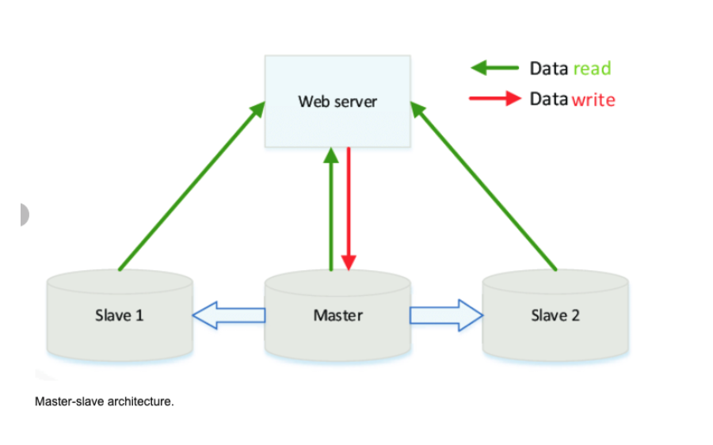
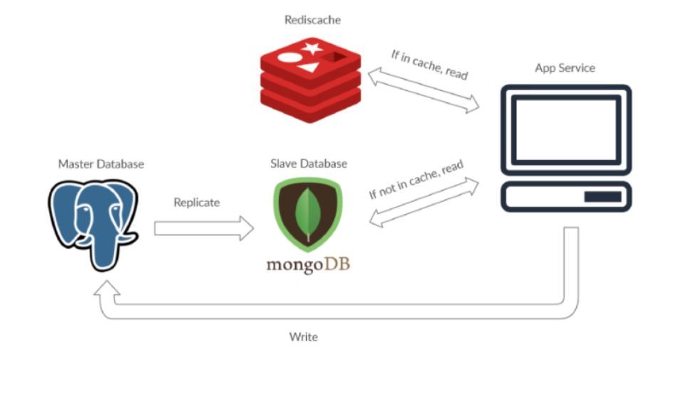
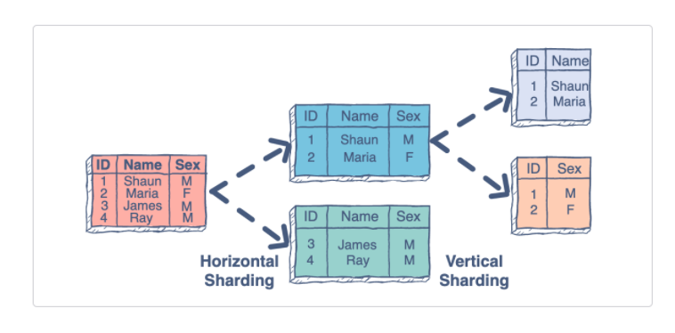

# Master + Slave
______

- Master-slave is a way to optimize the I/O in your application other than using caching. 
- The master database serves as the keeper of most current information.
- The true data is kept at the master database, thus writing only occurs there.
- Reading is only done in the slave. 
- Master is the true data keeper while a slave is a replication of master.
- This architecture serves the purpose of safeguarding site reliability. 
- If a site receives a lot of traffic and the only available database is one master, it will be overloaded with reading and writing requests. 
- Making the entire system slow for everyone on the site.

### Sharding 
- Is the process of making partitions of data in a database or search engine, such that the data is divided into various smaller distinct chunks, or shards.
- Sharding results in less read and write traffic, less replication, and more cache hits.
- Index size is also reduced, which generally improves performance with faster queries. 
- Common approach is performing horizontal sharding. For example, you can take a tweets table and shard by User ID (Number of User Ids  % mod Number of Database Master Servers) 

**Disadvantages**
You'll need to update your application logic to work with shards, which could result in complex SQL queries.
Data distribution can become lopsided in a shard. For example, a set of power users on a shard could result in increased load to that shard compared to others.
Rebalancing adds additional complexity. A sharding function based on consistent hashing can reduce the amount of transferred data.
Joining data from multiple shards is more complex.
Sharding adds more hardware and additional complexity.
