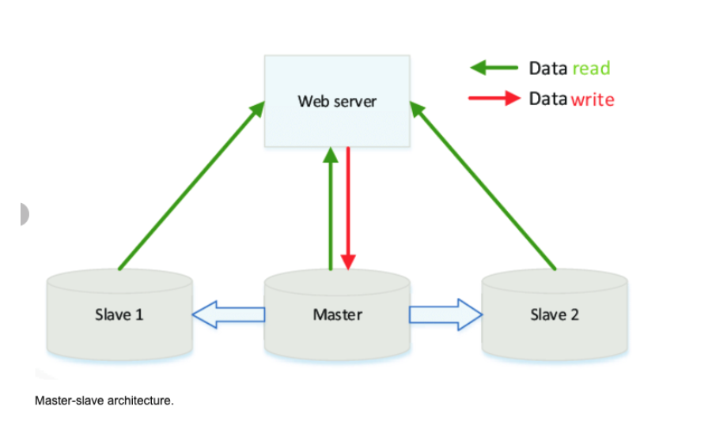

# Databases
_____

### Relational Databases
- Relational database management system (RDBMS)
- A relational database like SQL is a collection of data items organized in tables.
- ACID is a set of properties of relational database transactions.
  - **Atomicity** - Each transaction is all or nothing
  - **Consistency** - Any transaction will bring the database from one valid state to another
  - **Isolation** - Executing transactions concurrently has the same results as if the transactions were executed serially
  - **Durability** - Once a transaction has been committed, it will remain so

### Master + Slave

- Master-slave is a way to optimize the I/O in your application other than using caching. 
- The master database serves as the keeper of most current information.
- The true data is kept at the master database, thus writing only occurs there.
- Reading is only done in the slave. 
- Master is the true data keeper while a slave is a replication of master.
- This architecture serves the purpose of safeguarding site reliability. 
- If a site receives a lot of traffic and the only available database is one master, it will be overloaded with reading and writing requests. 
- Making the entire system slow for everyone on the site.




### In Memory Stores
- In-memory caches such as Memcached and Redis are key-value stores between your application and your data storage. Since the data is held in RAM, it is much faster than typical databases where data is stored on disk

**Cache**
- Idea: “recently requested data is likely to be requested again”
- A cache is like short-term memory: it has a limited amount of space, but is typically faster than the original data source and contains the most recently accessed items. 
- Caches can exist at all levels in architecture, but are often found at the level nearest to the front end, where they are implemented to return data quickly without taxing downstream levels.
- Placing a cache directly on a request layer node enables the local storage of response data. 
- Each time a request is made to the service, the node will quickly return locally cached data if it exists. 

**Advantages**
- Reduce Network Calls
- Cached data stores like Redis stores Key/Value pairs. 
- Avoid Re-Calculations
  - Example: an application makes a request to find the average age of the users. 
  - You would have to go to the database, search all in the records and compute the average each time! Very Expensive! 
  - You could compute it once and save it as a key/value pair. 
- Avoid Loads on the Database 
  - If you have a lot of servers trying to get data from the database, could put a heavy load on the database and slow performance
  - Could keep some data in cache to help on this. 

**Disadvantages**
- Can be expensive (hardware = SSD)
- Need to maintain consistency between caches and the source of truth such as the database through cache invalidation.
- Cache invalidation is a difficult problem, there is additional complexity associated with when to update the cache.
- Need to make application changes such as adding `Redis` or `memcached`.
- Cache & Database Sync

**Read Through**
- For immutable operations (read):
- Client will always simply read from cache. 
- Either cache hit or cache miss is transparent to the client. If it is a cache miss, the cache should have the ability to automatically fetch from the database.
- For mutable operations (create, update, delete):
- This strategy does not handle mutable operations. 
- It should be combined with write through (or write behind) pattern.
- **Drawback:**
  - Many cache layers may not support it. For example, Redis would not be able to
    fetch from 
  - MySQL automatically (unless you write a plugin for Redis).

**Write Through**
- For immutable operations (read):
- This strategy does not handle immutable operations. It should be combined with read through pattern.
- For mutable operations (create, update, delete):
- The client only needs to create, update or delete the entry in Redis. The cache layer has to atomically synchronize this change to MySQL.
- **Drawback**
  - First, many cache layers would not natively support this. 
  - Second, Redis is a cache rather than an RDBMS. It is not designed to be resilient. Thus, changes may be lost before they are replicated to MySQL. 
  - Even if Redis has now supported persistence techniques such as RDB and AOF, this approach is still not recommended.


## NoSQL
- NoSQL is a collection of data items represented in a key-value store, document store, wide column store, or a graph database.
- Data is denormalized, and joins are generally done in the application code. Most NoSQL stores lack true ACID transactions and favor eventual consistency.
- BASE is often used to describe the properties of NoSQL databases:
- Basically available - the system guarantees availability.
- Soft state - the state of the system may change over time, even without input.
- Eventual consistency - the system will become consistent over a period of time, given that the system doesn't receive input during that period.

**Key-Value Store**
- Allows for O(1) reads and writes and is often backed by memory or SSD.
- Key-value stores can allow for storing of metadata with a value.
- Key-value stores provide high performance and are often used for simple data models or for rapidly-changing data, such as an in-memory cache layer. Since they offer only a limited set of operations, complexity is shifted to the application layer if additional operations are needed.
- A key-value store is the basis for more complex systems such as a document store, and in some cases, a graph database.

**Document Store**
- A document store is centered around documents (XML, JSON, binary, etc), where a document stores all information for a given object. Document stores provide APIs or a query language to query based on the internal structure of the document itself. Note, many key-value stores include features for working with a value's metadata, blurring the lines between these two storage types.
- Based on the underlying implementation, documents are organized by collections, tags, metadata, or directories. Although documents can be organized or grouped together, documents may have fields that are completely different from each other.
- Some document stores like MongoDB and CouchDB also provide a SQL-like language to perform complex queries. 
- DynamoDB supports both key-values and documents.

### SQL vs NOSQL

**Reasons for SQL:**
- Structured data
- Strict schema
- Relational data
- Need for complex joins
- Transactions
- Clear patterns for scaling
- More established: developers, community, code, tools, etc
- Lookups by index are very fast

**Reasons for NoSQL:**
- Semi-structured data
- Dynamic or flexible schema
- Non-relational data
- No need for complex joins
- Store many TB (or PB) of data
- Very data intensive workload
- Very high throughput for IOPS

**Sample data well-suited for NoSQL:**
- Rapid ingest of clickstream and log data
- Leaderboard or scoring data
- Temporary data, such as a shopping cart
- Frequently accessed ('hot') tables
- Metadata/lookup tables


### Sharding 
- Is the process of making partitions of data in a database or search engine, such that the data is divided into various smaller distinct chunks, or shards.
- Sharding results in less read and write traffic, less replication, and more cache hits.
- Index size is also reduced, which generally improves performance with faster queries. 
- Common approach is performing horizontal sharding. For example, you can take a tweets table and shard by User ID (Number of User Ids  % mod Number of Database Master Servers) 


**Disadvantages**
You'll need to update your application logic to work with shards, which could result in complex SQL queries.
Data distribution can become lopsided in a shard. For example, a set of power users on a shard could result in increased load to that shard compared to others.
Rebalancing adds additional complexity. A sharding function based on consistent hashing can reduce the amount of transferred data.
Joining data from multiple shards is more complex.
Sharding adds more hardware and additional complexity.

### Denormalization
- Denormalization attempts to improve read performance at the expense of some write performance.
- Once data becomes distributed with techniques such as federation and sharding, managing joins across data centers further increases complexity. 
- Denormalization might circumvent the need for such complex joins.
- To avoid expensive joins, Denormalize where performance demands it.

**Disadvantages**
- Data is duplicated.
- Constraints can help redundant copies of information stay in sync, which increases complexity of the database design.
- A denormalized database under heavy write load might perform worse than its normalized counterpart.

### Data Storage

- Solution to Data Challenges of a Data Lake → Delta Lakes


### Delta Lakes


- Delta stores a transaction log to keep track of all the commits made to the table directory to provide ACID transactions 
- ACID = atomicity, consistency, isolation, durability
- Also enables schema enforcement, by helping to avoid bad data getting your data lakes by providing the ability to specify the schema. 
- Supports schema evolution like adding a new column.
- Handles Unified Batch and Stream Processing.
- If we have a use-case of both Stream processing and Batch processing it is normal to follow `Lambda Architecture`.
 Data coming in as Stream or any historical data you have is the same table being updated.


**Z-Ordering**
- is a technique to colocate related information in the same set of files. Z-ordering is basically a data-skipping algorithm to dramatically reduce the amount of data that needs to be read. 
- To Z-Order data, you specify the columns to order on in the `ZORDER BY `clause:

```
OPTIMIZE events
WHERE date >= current_timestamp() - INTERVAL 1 day
ZORDER BY (eventType)
```

### Partition Strategy
- You can partition a Delta table by a column. 
- The most commonly used partition column is date.
- If the cardinality of a column will be very high, do not use that column for partitioning.
- For example, if you partition by a column userId and if there can be 1M distinct user IDs, then that is a bad partitioning strategy.
- Amount of data in each partition: You can partition by a column if you expect data in that partition to be at least 1 GB.

**Data Compaction:** 
- If you continuously write data to a Delta table, it will over time accumulate a large number of files, especially if you add data in small batches. 
- This can have an adverse effect on the efficiency of table reads, and it can also affect the performance of your file system. Ideally, a large number of small files should be rewritten into a smaller number of larger files on a regular basis. 
- This is known as `compaction`.
- You can compact a table by repartitioning it to a smaller number of files.

### Parquet
- Default data source in Spark
- Open-source columnar file format that offers I/O optimization such as data compression, which gives quick access to data columns for querying
- **Directory Structure:**
  - Data Files, metadata, number of compressed files, and some status files

### Data Serialization
- Serialization is the process of converting an object into a stream of bytes to store the object or transmit it to memory, a database, or a file. 
- Its main purpose is to save the state of an object in order to be able to recreate it when needed. The reverse process is called deserialization.
- Serialization is the process of converting an object into a stream of bytes to store the object or transmit it to memory, a database, or a file. 
- Its main purpose is to save the state of an object in order to be able to recreate it when needed. The reverse process is called deserialization.

## Data Warehouse
- A database designed to store and process large volumes of current and historical data collected from multiple sources inside and outside the enterprise for deep analysis.
- Organizes data into tables and columns, and allows users access via SQL.
- Optimized for loading, integrating and analyzing very large amounts of data.
- Designed to support descriptive, diagnostic, predictive and prescriptive analytic workloads.
Example: Snowflake