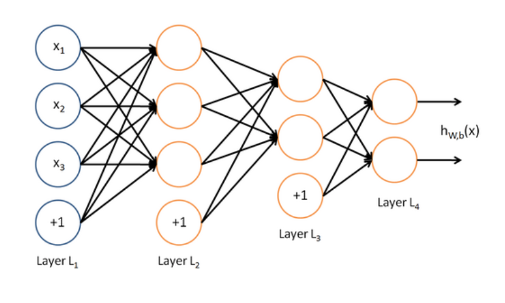
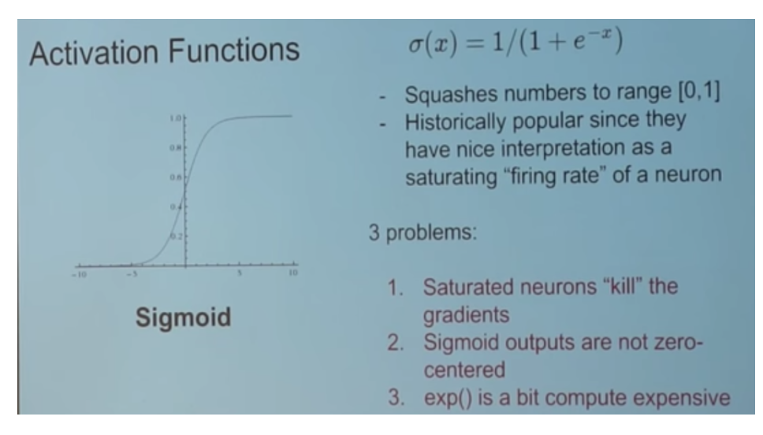
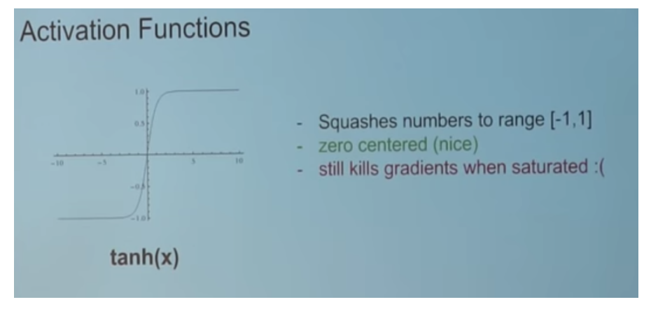
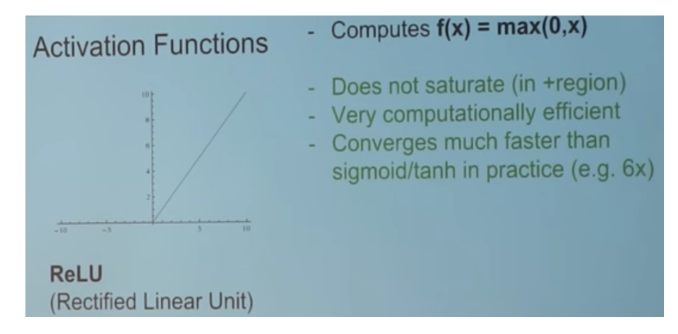
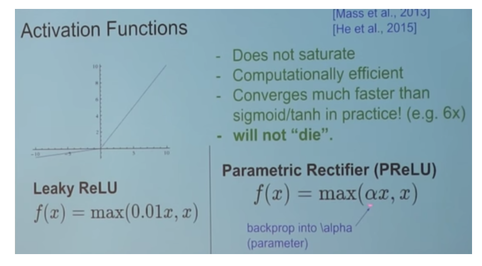
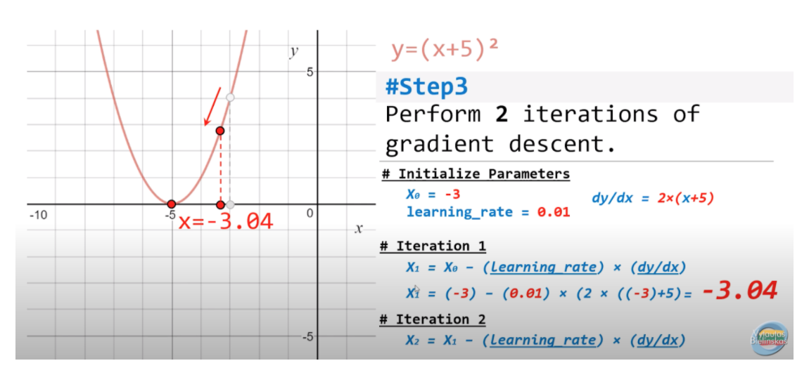
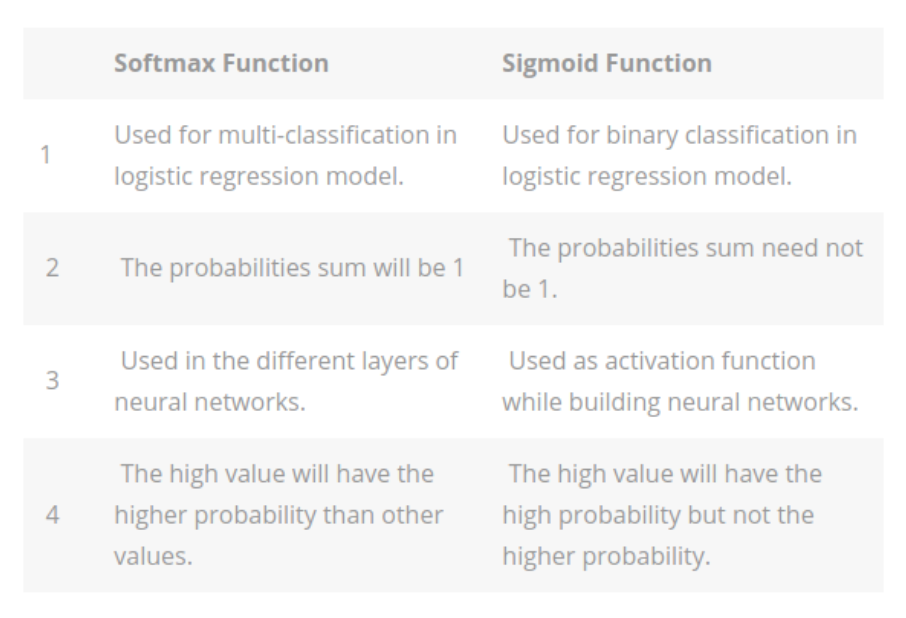
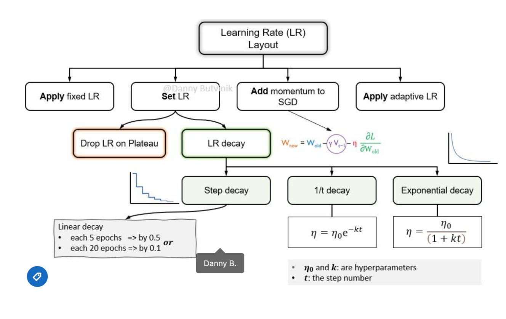
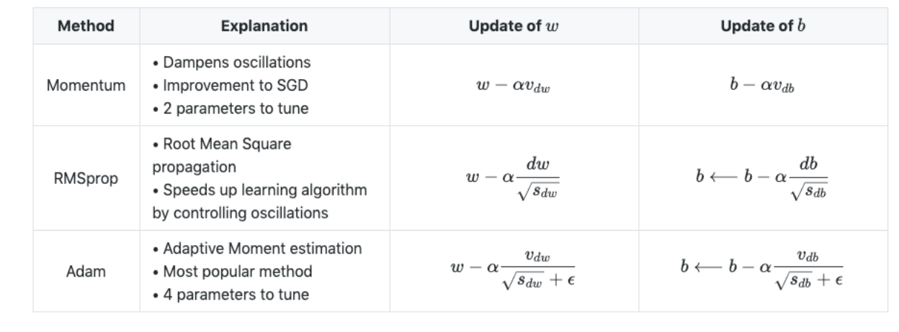

# Deep Learning
______

### Feed Forward Neural Networks

**Steps**

- **Feed Forward:** takes an input, passes it through multiple layers of hidden neurons and outputs a prediction representing the combined input of all the neurons.
- **Input Layer:** is the layer consisting of the input data which is passed to the first hidden layer in the network. Each layer in the network consists of a series of neurons. 
- `Neuron` is the weighted sum of the inputs plus bias and then feeds the sum through a non-linear activation function. 
  - The outputs of the neurons are then passed to the next layer. 
  - This process is repeated for each layer in the network until the output layer. 
- **Hidden Layers:** reside in-between input and output layers and can consist of ‘n’ layers which can be a hyperparameter to tune for. 
  - The larger the number of hidden layers in a neural network will take longer to train
- **Output layer:**: produces the class label or target, depending whether this is a classification or regression task.
  - Model prediction and compare with the ground truth. 

**Goal**
- The objective is to `minimize `the Loss Function.
- Where the loss function quantifies how “good” or “bad” a given model is in classifying the input data 

**Backpropagation**: 
- Next we perform back prop which is a method to update the
weights in the neural network by taking into account the actual output and the
desired output. 
- The derivative with respect to the weights is computed using chain rule. 
- We perform this backward pass to adjust the weights and biases in the network to optimize the cost function and minimize the loss function. 

### Activation Functions 

- Functions used at the end of a hidden unit to introduce non-linear
  complexities to the model.
- **Reference**: Andrej Karpathy |CS231n Winter 2016: Lectures on Convolutional Neural Nets
  - [Link](https://www.youtube.com/watch?v=NfnWJUyUJYU&list=PLkt2uSq6rBVctENoVBg1TpCC7OQi31AlC)

**Sigmoid Function (Logistic Function)**

- In order to map predicted values to probabilities, we use the sigmoid function. The function maps any real value into another value between 0 and 1. In machine learning, we use sigmoid to map predictions to probabilities.

**Tanh**

**Relu**

**Leaky Relu**

### Dropout
- Is a technique meant to prevent overfitting the training data by dropping out units in a neural network. In practice, neurons are either dropped with probability.

### Epoch
- Epoch is a term used to refer to one iteration where the model sees the whole training set to update its weights.

### Gradient Descent

- Optimization algorithm used to minimize the loss function by iteratively moving in the direction of steepest descent as defined by the negative of the gradient

**Steps:**
- Calculate gradients of the loss/error function, then updating existing parameters in response to the gradients.
- This new gradient tells us the slope of our cost function at our current position and the direction we should move to update our parameters. 
- And finally, the size for updating the weights is controlled by the learning rate.
- **Linear Models:** shape of loss function: convex shape
- **Non-Linear Models:** non-convex optimization (needs GPU)

### Batch Gradient Descent
- Same as vanilla gradient descent and computes the gradient of the cost function with respect to the parameters for the entire dataset
- During batch gradient descent, the algorithm has to scan every single instance of the training set before taking a single step, which can take longer to compute, especially for larger datasets.
  
### Stochastic Gradient Descent
- In SGD, we repeatedly run through the training set data and update the parameters according to the gradient of the error with respect to the corresponding training example
Often the case, SGD performs much faster than batch gradient descent as moves closer to the minimum quick
- In SGD fluctuation enables it to jump to new and potentially better local minima and converge quicker

### Stochastic Weighting Average
- Reference: https://pytorch.org/blog/stochastic-weight-averaging-in-pytorch/

### Mini-batch Gradient Descent 
- Takes the best of both worlds (batch and stochastic) and performs an update for every mini-batch of  ‘n’ training examples.
  
### Softmax 

- In a neural network, the raw predictions which come out of the last layer of the network - which converts these values to probabilities for multi-class labels. 

### Learning Rate
- Controls how much to change the model in response to the estimated error each time the model weights are updated or can be thought of as the size of the step size taken when performing gradient descent. 
- **High Learning Rate:** If the learning rate is set too high, it can cause undesirable divergent behavior in your loss function
Large LR puts the model at risk of exceeding the minima so it will not be able to converge: what is known as `EXPLODING GRADIENT`.
- **Low Learning Rate:** If the LR is set too low, training will progress very slowly as you are making very tiny updates to the weights in your network. A smaller LR will increase the risk of overfitting.

**Adaptive Learning Rates**
- (*) No manual tuning of the learning rate is required;
- (*) η is adjusted by the optimizer to perform larger or smaller updates depending on the importance of the weight;
- In practice: decay learning rate over time. 

### Optimizers

- **Adam**: optimization is a stochastic gradient descent method that is based on adaptive estimation of first-order and second-order moments.
- **Adagrad**: is an optimizer with parameter-specific learning rates, which are adapted relative to how frequently a parameter gets updated during training. The more updates a parameter receives, the smaller the updates.
- **Adadelta**: optimization is a stochastic gradient descent method that is based on adaptive learning rate per dimension to address two drawbacks:
  - The continual decay of learning rates throughout training.
  - The need for a manually selected global learning rate

### Batch Normalization

- We normalize the input layer by adjusting and scaling the activations. 
- This allows each layer of a network to learn by itself a little bit more independently of other layers.
- It also allows for a higher learning rate because batch normalization makes sure that there’s no activation that’s gone really high or really low.
- It reduces overfitting because it has a slight regularization effect as it adds some noise to each hidden layer’s activations.
- It works by normalizing the output of a previous activation layer by subtracting the batch mean and dividing by the batch standard deviation
- Therefore, batch normalization adds two trainable parameters to each layer, so the normalized output is multiplied by a “standard deviation” parameter  and add a “mean” parameter .
- BN usually done after a fully connected/convolutional layer and before a non-linearity layer and aims at allowing higher learning rates and reducing the strong dependence on initialization.

### Overfitting
- Ways to address overfitting:
  - Augmentation (e.g. images: flip/scale/rotate)
  - Decrease batch size
  - Add dropout rate 
  - Weight decay 
  - Early stopping
  - Regularization 
