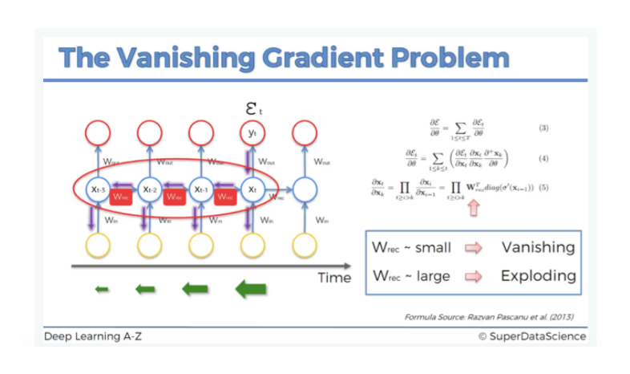
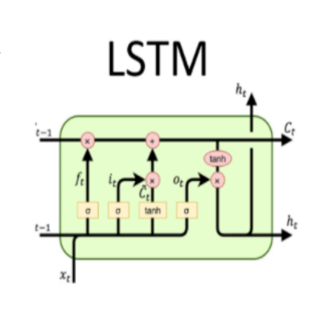

# Recurrent Neural Networks
____

- Feed-forward network that is rolled out over time and operates over sequences. State receives input vector from the previous layer (or step) and can modify that state at what it receives at every step. With RNNs, we use `Backpropagation` in time.

**Problem with RNNs:**
- You are repeatedly multiplying by the same weight matrix. 
- This can cause exploding or vanishing gradients -- where the model is not capable learning long sequences. 
- Exploding gradients are less of the problem since you could easily apply a simple gradient clipping algorithm. 
- Vanishing gradients can also be difficult to spot making it more dangerous when deploying your system into production. 

**Method:**
- First, the initial hidden state, which is typically a vector of zeros and the hidden state weight is multiplied and then the hidden state bias is added to the result. 
- In the meantime, the input at the time step “t” and the input weight  is multiplied and the input bias is added to that result. 
- We can obtain the hidden state at time step t by sending the addition of the above two results through an activation function, typically tanh (f)
 
## GRU

- With RNNs, long products of matrices can lead to vanishing or divergent gradients.
- We may have cases where an early observation is highly significant for predicting all future observations so we would like to have some mechanisms for storing vital early information in a memory cell.

**The key distinction between regular RNNs and GRUs:**
- The latter support gating of the hidden state. This means that we have dedicated mechanisms for when a hidden state should be updated and also when it should be reset.
- **Components:**
  - **Reset gate:** helps capture short-term dependencies	
  - **Update gate:** help capture long-term dependencies 

## LSTM
- To address long-term information preservation by a memory cell with a series of gates to control information flow. 
- **The LSTM gates are:**
  - **Input Gate:** To update the cell state, we have the input gate. We first pass the previous hidden state and current input into a sigmoid function. That decides which values will be updated by transforming the values to be between 0 and 1. 0 means not important, and 1 means important
  - **Forget Gate:** decides what information should be thrown away or kept. Information from the previous hidden state and information from the current input is passed through the sigmoid function. Values come out between 0 and 1. The closer to 0 means to forget, and the closer to 1 means to keep.
  - **Output Gate:** decides what the next hidden state should be. Remember that the hidden state contains information on previous inputs. 

