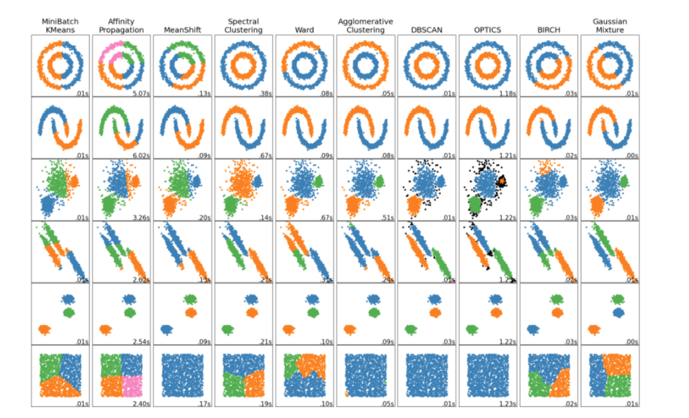
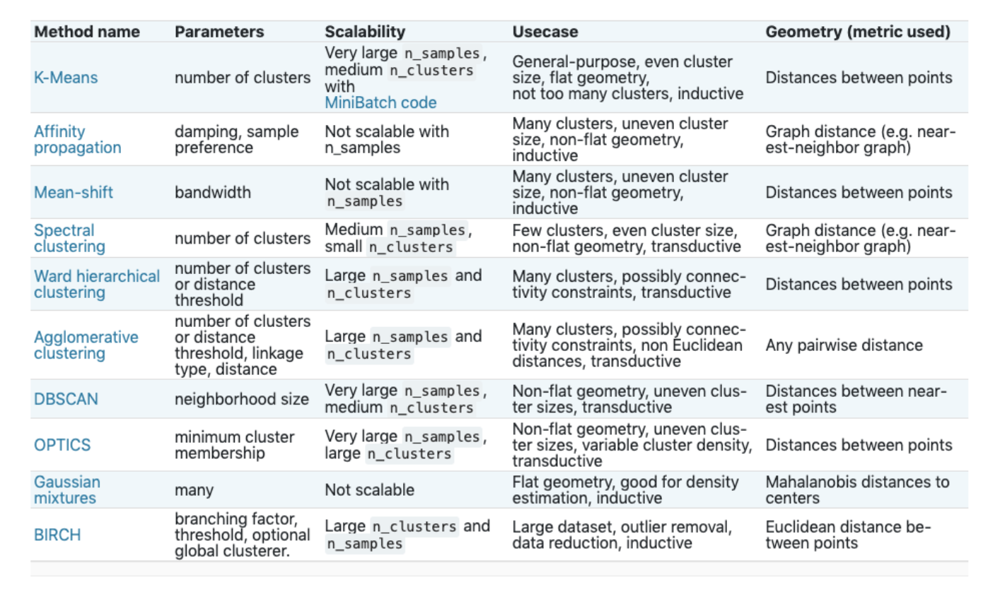

# Clustering
__________

## Overview

## Selecting Cluster Algorithm 

## K-Means Clustering
- KMeans is an iterative process and aims to partition `N` observations into
  `K` where observation belongs to the cluster with the closest mean. 
- By assigning `N` observations to `K` clusters such that within each the
  average dissimilarity of the  observations from the cluster mean (i.e.
  centroid) is minimized. 
- Specify the number of clusters `k`
- Randomly pick k centroids from the data points as initial cluster centers
- Assign each sample to the nearest centroid (i.e. Euclidean distance)
- Move the centroids to the center of the samples that were assigned to it
- Repeat the `third` and `fourth` steps until the cluster assignment converges
 

## Evaluation of Clusters

**Elbow method:** 
- plot number of clusters versus interia
- **Inertia:** measure of how internally coherent clusters are
- **Cohesion:** measures how closely related are objects in a cluster
- **Separation:** measures how distinctly separated a cluster is from other clusters

**Calinski-Harabasz:**
- Also known as the `Variance Ratio Criterion`
- Indicates how well a clustering model defines its clusters, such that the
  higher the score, the more  dense and well separated the clusters are.

**Silhouette Coefficient:** 
- Is calculated using the mean intra-cluster distance
(a) and the mean nearest-cluster distance (b) for each sample. 
	- The Silhouette Coefficient for a sample is (b - a) / max(a, b)
	- The best value is 1 and the worst value is -1. 
    - Values near 0 indicate overlapping clusters. Negative values generally
      indicate that a sample  has been assigned to the wrong cluster, as a
      different cluster is more similar.

### Difference between KNN and KMeans
- K-NN is a Supervised machine learning while K-means is an unsupervised machine learning.
- K-NN is a classification or regression machine learning algorithm while 
- K-NN performs much better if all of the data have the same scale but this is
  not true for K-means. 
- K-means is a clustering machine learning algorithm and used for unsupervised ML tasks.

## Hierarchical Clustering 
- Agglomerative Clustering is a clustering algorithm that builds nested
  clusters by merging or splitting them successively. 
- This hierarchy of clusters is represented as a tree (or dendrogram). 
- Hierarchical clustering using a bottom up approach: 
  - Each observation starts in its own cluster, and clusters are successively merged together. 
- Hierarchical clustering algorithms aims at optimizing different objective functions:
- **Ward** minimizes the sum of squared differences within all clusters. It is
  a variance-minimizing  approach and in this sense is similar to the k-means
  objective function but tackled with an agglomerative hierarchical approach.
- **Maximum or complete linkage:** minimizes the maximum distance between observations of pairs of clusters.
- **Average linkage minimizes** the average of the distances between all observations of pairs of clusters.
- **Single linkage** minimizes the distance between the closest observations of pairs of clusters.

## DBSCAN
- Clustering algorithm views clusters as areas of high density separated by areas of low density.
- Clusters found by DBSCAN can be any shape, as opposed to k-means which
  assumes that clusters are  convex shaped. 

**Affinity Propagation**
- Affinity Propagation creates clusters by sending messages between pairs of
  samples until convergence. 
- The messages sent between pairs represent the suitability for one sample to
  be the exemplar of the  other, which is updated in response to the values
  from other pairs. 
- This updating happens iteratively until convergence, at which point the final
  exemplars are chosen,  and hence the final clustering is given.

