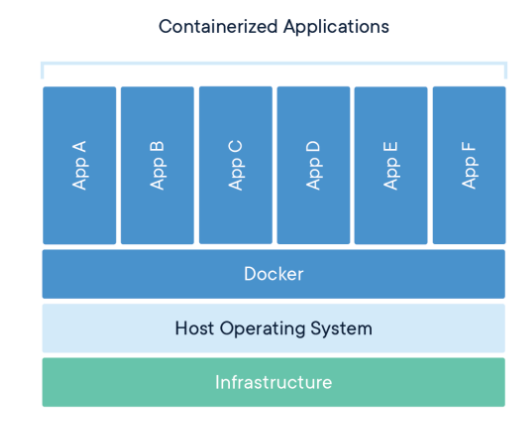
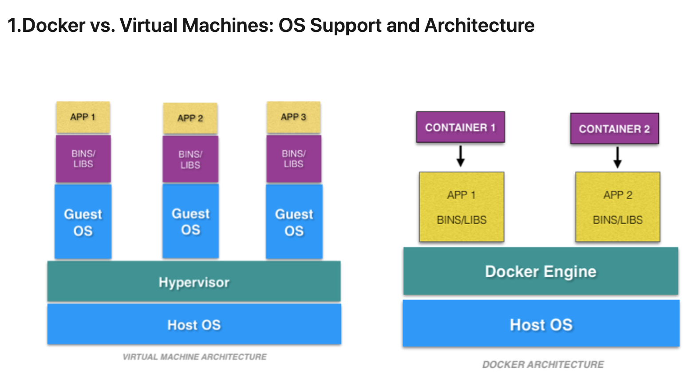

# Docker
_____

**Overview**
- Docker is an open platform for developing, shipping, and running applications. Docker enables you to separate your applications from your infrastructure so you can deliver software quickly.



### Images
- Image is a read-only template with instructions for creating a Docker container. Often, an image is based on another image, with some additional customization. For example, you may build an image which is based on the ubuntu image, but installs the Apache web server and your application, as well as the configuration details needed to make your application run.

### Containers
- A container is a runnable instance of an image. You can create, start, stop, move, or delete a container using the Docker API or CLI. You can connect a container to one or more networks, attach storage to it, or even create a new image based on its current state.

### Architecture
- Docker uses a client-server architecture. 
- The Docker client talks to the Docker daemon, which does the heavy lifting of building, running, and distributing your Docker containers. 
- Docker client and daemon can run on the same system, or you can connect a Docker client to a remote Docker daemon. 
- The Docker client and daemon communicate using a REST API, over UNIX sockets or a network interface.
- Docker daemon listens for Docker API requests and manages Docker objects such as images, containers, networks, and volumes. 

### Docker Compose 
- Compose is a tool for defining and running multi-container Docker applications. 
- With Compose, you use a YAML file to configure your application’s services
- In short, Docker Compose works by applying many rules declared within a single docker-compose.yml configuration file.
- These YAML rules, both human-readable and machine-optimized, provide us an effective way to snapshot the whole project from ten-thousand feet in a few lines.
- Almost every rule replaces a specific Docker command so that in the end we just need to run: `docker-compose up`.

- **Volumes**: on the other hand, are physical areas of disk space shared between the host and a container, or even between containers. In other words, a volume is a shared directory in the host, visible from some or all containers.
- **Networks**: define the communication rules between containers, and between a container and the host. Common network zones will make containers' services discoverable by each other, while private zones will segregate them in virtual sandboxes.
- Docker containers communicate between themselves in networks created, implicitly or through configuration, by Docker Compose. A service can communicate with another service on the same network by simply referencing it by container name and port (for example network-example-service:80), provided that we've made the port accessible through the expose keyword.

### Docker vs Virtual Machine

- Lightweight architecture of `Docker` makes it less resource-intensive feature makes it
a better choice than a virtual machine in some cases.

**Advantages of using Docker**
- Reduced IT management resources 
- Reduced size of snapshots 
- Quicker spinning up apps
- Reduced and simplified security updates
- Less code to transfer, migrate, and upload workloads

**I. OS Support and Architecture** 
- Virtual machine has its guest operating system above the host operating
  system, making virtual machines `heavy`. 
- Docker containers share the host operating system, and that is why they are `lightweight`.
  - Sharing the host operating system between the containers make them very light and helps them to boot up in just a few seconds. 
  - The overhead to manage the container system is very low compared to that of virtual machines



**II. Security**
- Virtual machines are stand-alone with their kernel and security features. Therefore, applications needing more privileges and security run on virtual machines.
- providing root access to applications and running them with administrative premises is not recommended in the case of Docker containers because containers share the host kernel. The container technology has access to the kernel subsystems; as a result, a single infected application is capable of hacking the entire host system

- [Reference](https://www.linkedin.com/pulse/what-docker-benefits-over-virtual-machine-rama-krishna-palnati/?trackingId=c9Z7FMiTShaELfEoeH32DQ%3D%3D)


### Dockerfile Commands

- **RUN**: Instruction will execute any commands in a new layer on top of the current image and commit the results. The resulting committed image will be used for the next step in the Dockerfile.
- **COPY**: copies new files or directories from <src> and adds them to the filesystem of the container at the path destination 
- **CMD**: can be used to provide default arguments for the ENTRYPOINT instruction
- **EXPOSE**: instruction informs Docker that the container listens on the specified network ports at runtime.
- **ENV**: instruction sets the environment variable <key> to the value <value>
- **ADD**: Instruction copies new files, directories or remote file URLs from <src> and adds them to the filesystem of the image at the path <dest>
- **ENTRYPOINT**: allows you to configure a container that will run as an executable.
You can specify a plain string for the ENTRYPOINT; will execute in /bin/sh -c
- **VOLUME**: instruction creates a mount point with the specified name and marks it as holding externally mounted volumes from native host or other containers.
- **USER**: instruction sets the user name (or UID) and optionally the user group (or GID) to use when running the image and for any RUN, CMD and ENTRYPOINT instructions that follow it in the Dockerfile.
- **WORKDIR**: instruction sets the working directory for any RUN, CMD, ENTRYPOINT, COPY and ADD instructions 
- **ARG**: instruction defines a variable that users can pass at build-time to the builder with the docker build

### Docker Command Line
```
docker build . --tag example.azurecr.io/example:latest
Builds image
docker push example.azurecr.io/example:latest
Pushes image to container registry 
docker images -f <id>
Remove image
docker prune images
Remove all images
docker-compose up -d
```

**Starting a docker container in detached mode**
- Runs the container in the background so it doesn’t receive any
  inputs/outputs: `docker ps`

**View containers running in the background**
- Allows you to launch airflow instance and execute bash commands inside the
  container: `docker-compose exec webserver /bin/bash`

### Dockerfile Example
```
FROM python-36-rhel7
	COPY requirements.txt ./
RUN /bin/bash -c “””pip install -r requirements.txt”””
	RUN mkdir /source
	ADD ./dags /usr/local/airflow/dags
```