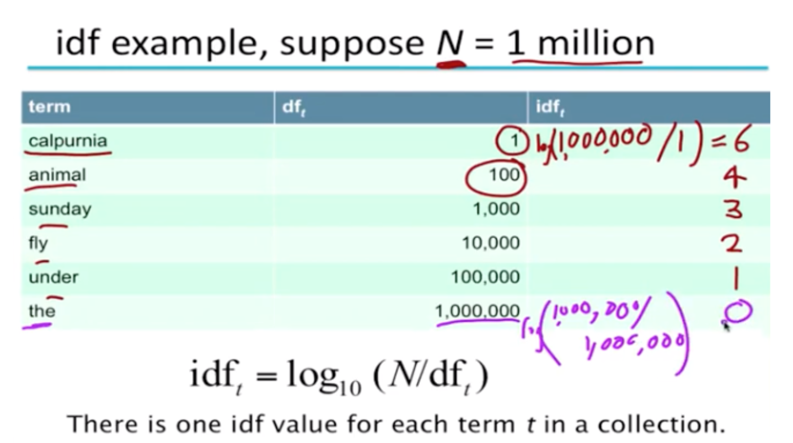
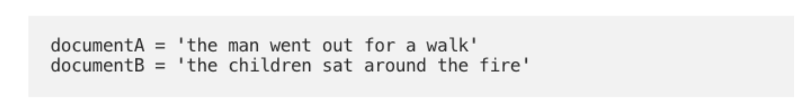
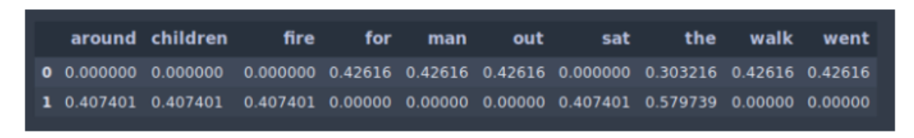

# Natural Language Processing
______

## Text Preprocessing

Preprocessing Steps:
- Remove stopwords and extra whitespaces 
- Remove punctuation
- **Lemmatization**: converting a word to its base form (e.g. caring to care)
  - Lemmatization considers the context and converts the word to its meaningful base for
- **Stemming**: removes the last few characters, often leading to incorrect mea

## Tokenization
- Vocabulary refers to the set of unique tokens in the corpus.
- Vocabulary can be constructed by considering each unique token in the corpus or by considering the top K Frequently Occurring Words.
  - vocab = sorted(set(text))
  - vocab_to_int = {c: i for i, c in enumerate(vocab)}
  - int_to_vocab = dict(enumerate(vocab))
  - encoded = np.array([vocab_to_int[c] for c in text], dtype=np.int32)Text Feature Extraction
 
## TFIDF
- Term Frequency — Inverse Document Frequency”. 
- Rare terms are more informative than frequent terms
- We want to give higher weight to rare terms. 
- Frequent terms are less informative than rare terms
- We want to give positive weights for frequent terms but lower weights than for rare terms 

**Term Frequency:** 
- The number of times a word appears in a document divided by the total number of words in the document. 

**Inverse Document Frequency**
- The log of the number of documents divided by the number of documents that contain the word “w”.
- The log is used to dampen the inverse document frequency. 




Where: `N` = number of documents in collection. 

**Example**



**TF-IDF Code Example**

```
vectorizer = TfidfVectorizer(stop_words='english')
vectors = vectorizer.fit([document1, document2])
feature_names = vectorizer.get_feature_names()

dense = vectors.todense()
denlist = dense.tolist()
df = pd.DataFrame(denselist, columns=feature_names)
```

### Reference
[Christopher Manning Lectures | Stanford University](https://www.youtube.com/watch?v=pxYkuWEOKjc)

## Bag of Words

- In bag of words representation the length of the vector is determined by the number of unique words in our corpus.
**Disadvantage:**
- Lack of meaningful relations and no consideration for order of words: BOW is a collection of words that appear in the text or sentences with the word counts. 
- Bag of words does not take into consideration the order in which they appear.
- Sparse Matrix

## Skip Grams
- Train the neural network to do the following. 
- Given a specific word in the middle of a sentence (the input word), look at the words nearby and pick one at random. 
- The network is going to tell us the probability for every word in our vocabulary of being the “nearby word” that we chose.
- Skip gram predicts the surrounding context words within a specific window given the current word. 
- The input layer contains the current word and the output layer contains the
  context words. 
- The hidden layer contains the number of dimensions in which
  we want to represent the current word present at the input layer.


## Named Entity Recognition
- Named entity recognition (NER) seeks to locate and classify named entities in text into predefined categories such as the names of persons, organizations, locations, expressions of times, quantities, monetary values, percentages, etc.
- The idea of NER is to tag a set of words in a sequence with a label representing the kind of entity the word belongs to.

**Approaches**
- Machine Learning: 
  - Treat the problem as a multi-class classification where named entities are our labels so we can apply different classification algorithms. 
  - The problem here is that identifying and labeling named entities require domain understanding of the context of a sentence and sequence of the word labels in it
- Deep Learning: 
  - A bidirectional LSTM is a combination of two LSTMs — one runs forward from “right to left” and one runs backward from “left to right”
  - Embeddings using ELMo: One of the biggest benefits of this approach is that we don’t need any feature engineering; all we need is the sentences and its labeled words, the rest of the work is carried on by ELMo embeddings. 

**Reference**:
https://www.depends-on-the-definition.com/sequence-tagging-lstm-crf/


