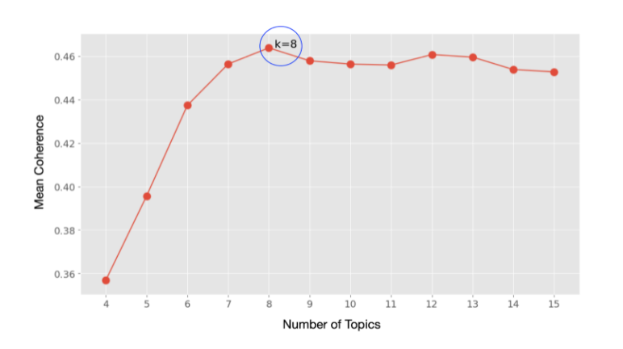
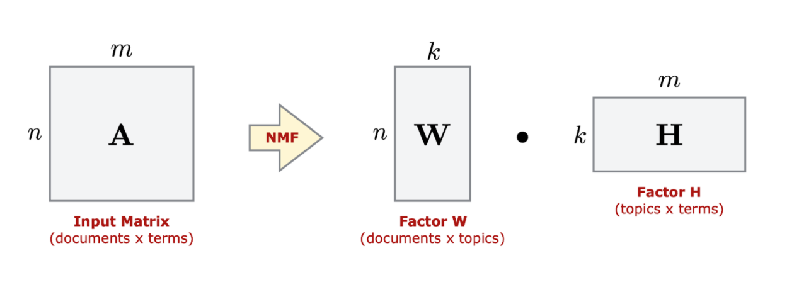

# Topic Modeling
______

- Topic modelling is an unsupervised text mining approach.
**Input**: corpus of unstructured text documents with no labels (reviews, news)
**Output**: Multiple topics for a single document or corpus

#### Steps 
- Tokenize: split raw text into individual tokens
- **Bag-of-Words Model:**
  - Method to move from tokens to numeric features
  - Each document is represented by a vector where m is the number of unique terms across all documents 
- **Create document-term matrix:**
  - Each document can be represented as a term vector, with an entry indicating the number of time a term appears in the document:
- **Additional Preprocessing steps:**
  - Minimum token length, like excluding tokens of length < 2 
  - Converting all words to lowercase.
  - Filter stop words
  - Stemming
- **Translate Document Term Matrix to:**
  - TF-IDF in order to give higher weights to more "important" terms. 
  - TF-IDF: Common approach for weighting the score for a term in a document. 
    - Term Frequency: Number of times a given term appears in a single document.
    - Inverse Document Frequency: basically penalizes common terms that appear in almost every document.

## Two Topic Modeling Approaches:
1. **Probabilistic** - view each document as a mixture of a small number of topics where words and documents get probability scores for each topic. 
   - Latent Dirichlet Allocation (LDA)
2. **Matrix Factorisation** - apply methods from linear algebra to decompose a single matrix into a set of smaller matrices
   - Non-negative Matrix Factorisation (NMF)

**Evaluate number of topics:**
1. **Perplexity**: how surprised a model is of new data it has not seen before, and is measured as the normalized log-likelihood of a held-out test set.
2. **Coherence**: Measures score a single topic by measuring the degree of semantic similarity between high scoring words in the topic



## NFM Model
- NMF can be applied for topic modeling, where the input is a document-term matrix 
  - **Input**: Document-term matrix A; Number of topics k. 
  - **Output**:  Two k-dimensional factors W and H approximating A
**H Factor:**
- Contains term weights relative to each of the k topics. 
- Each row corresponds to a topic, and each column corresponds to a unique term in the corpus vocabulary. 
- Sorting the values in each row gives us a ranking of terms 
**W Factor** 
- Contains document membership weights across the k topics. 
- Each row corresponds to a different document, and each column corresponds to a topic. 
- Sorting the values gives us a ranking of the most relevant documents for each topic.



## Latent Dirichlet Allocation
- LDA assumes that all words in the document can be assigned a probability of belonging to a topic.
- Topics in a document are unknown, but the idea is topics are present as the text is generated based on a distribution of topics and distribution of words in that topic.

**Goal**
- Determine the number of topics that a document contains.
- Each document is modeled as a multinomial distribution of topics
- Each topic is also modeled as a multinomial distribution of words.
- LDA assumes the text feed into the model will contain words that are related. 

**Steps**
- Tokenization: Split the text into sentences and the sentences into words, and lowercase words and remove punctuation
- Remove stopwords
- Lemmatize: Words in third person are changed to first person and verbs in past and future tenses are changed into present
- Stemming: Words are reduced to their root form
- Create Bag-of-Words Model
  - Dictionary containing the number of times a word appears in the training set.
- Can also create a N_Gram Model:
  - **bigrams** which are two words frequently occurring together in the document
  - **trigrams**, which  are 3 words frequently occurring - for example. This can provide more contextual information than just bag of words
- Perform TF-IDF on document set
- Perform Topic Model (e.g. LDA) + Evaluate 

**Example Output:**
```
Topic 1:
 _0.016“car” + 0.014“power” + 0.010“light” + 0.009“drive” + 0.007“mount” + 0.007“controller” + 0.007“cool” + 0.007“engine” + 0.007“back” + ‘0.006“turn”.
```

- It means the top 10 keywords that contribute to this topic are: ‘car’, ‘power’, ‘light’.. and so on and the weight of ‘car’ on topic 1 is 0.016.
- The weights reflect how important a keyword is to that topic
