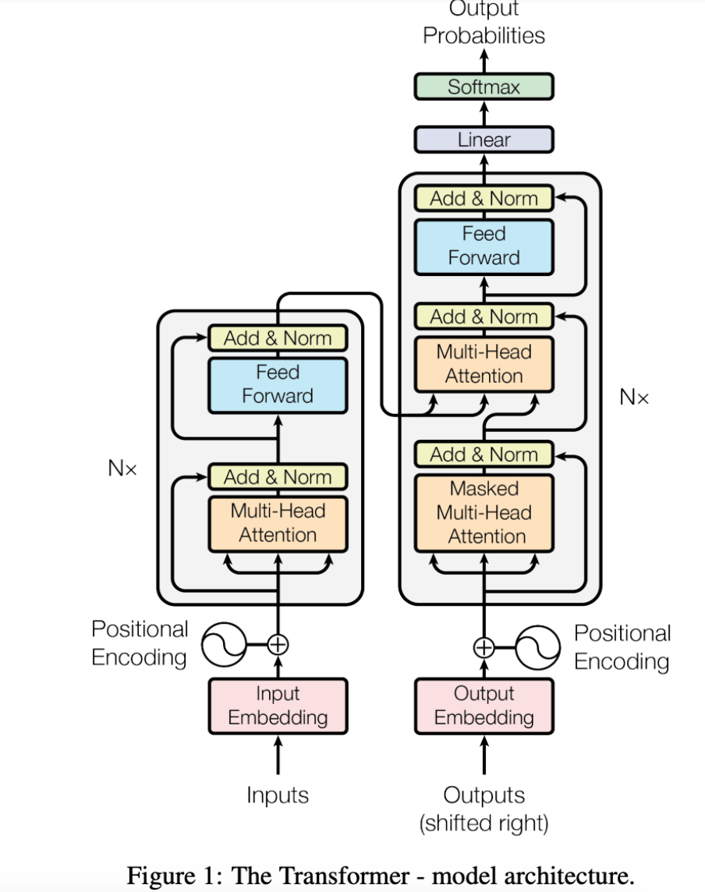

# Transformers
_____

## Self-Attention 

### Why Transformers?
- paper: *Attention Is All You Need - 2017*
- Attention allows the model to focus on the relevant parts of the input
  sequence as needed.  
- Self-attention is the method the `Transformer` uses to bake the
  “understanding” of other  relevant words into the one we’re currently
  processing. 
- Models like `ELMo` which uses LSTMs to alleviate the consequences of not
  having an attention mechanism to create an efficient way of `focusing` on the
  important word in each sentence.  
- This is the problem the Transformer network addressed by using the attention mechanism.

**Overview**
- Transformers compute `vector-space representations` of natural language that
  are suitable for use in deep learning models.  
- Based solely on attention mechanisms to compute representations of its input
  and output without using sequence aligned RNNs or convolutions.  
- The benefit of the transformer architecture is that it helps the model to retain infinitely long sequences that were not possible from the traditional RNNs, LSTMs, and GRU
- Still lacks contextual understanding.  

**Structure**
- `Attention is all you need` paper used attention to improve the performance
  of machine translation. They created a model with two main parts: 
  - **Encoder**: This part of the “Attention is all you need” model processes
    the input text, looks for important parts, and creates an embedding for
    each word based on relevance to other words in the sentence. (Stack of 6
    encoders) 
  - **Decoder**: This takes the output of the encoder, which is an embedding,
    and then turns that embedding back into a text output, i.e. the translated
    version of the input text (Stack of 6 Decoders). 

**Notes:**
- Neither the encoder nor the decoder used any recurrence or looping, like traditional RNNs. 
- Instead, they used layers of `attention` through which the information passes
  linearly. It didn’t loop over the input multiple times – instead, the
  Transformer passes the input through multiple attention layers.  
- You can think of each attention layer as `learning` more about the input,
  i.e. looking at different parts of the sentence and trying to discover more
  semantic or syntactic information.  
- This is important in the context of the vanishing gradient problem.
- **Reference**: http://jalammar.github.io/illustrated-bert/

### Encoders
- The encoders are all identical in structure (yet they do not share weights).
  Each one is broken down into two sublayers: self-attention and feed-forward  
- The encoder’s inputs first flow through a self-attention layer which helps
  the encoder look at other words in the input sentence as it encodes a
  specific word. 
- The outputs of the self-attention layer are fed to a feed-forward neural network. 

### Decoders
- The decoder has both those layers, but between them is an attention layer
  that helps the decoder focus on relevant parts of the input sentence 
- The output of the top encoder is then transformed into a set of attention vectors K and V. 
- These are to be used by each decoder in its “encoder-decoder attention” layer
  which helps the decoder focus on appropriate places in the input sequence 
- The decoder stack outputs a vector of floats which is passed to a final fully connected layer that projects the vector produced by the stack of decoders into a logits vector
- Softmax layer then turns those scores into probabilities 
- Output: the cell with the highest probability is chosen, and the word
  associated with it is produced as the output for this time step. 
- **Reference**: http://jalammar.github.io/illustrated-transformer/

### Transformer Architecture

### Calculate Self-Attention 
1. For each word, create a Query vector, a Key vector, and a Value vector and
   are created by multiplying the embedding by three matrices that we trained
   during the training process
2. Calculate a score to determine how much focus to place on other parts of the
   input sentence as we encode a word at a certain position.  
   The score is calculated by taking the dot product of the query vector with
   the key vector  
   So if we’re processing the self-attention for the word in position #1, the
   first score would be the dot product of q1 and k1.  
The second score would be the dot product of q1 and k2 and so on
3. Divide scores by 8; having more stable gradients (paper) 
4. Apply softmax to normalize the scores so they’re all positive and add up to 1.
   Determines how much each word will be expressed at this position (e.g. first
   word, etc.) 
5. Multiply each value vector by the softmax score; this helps drown-out
   irrelevant words when multiplying by small values. 
6. Sum up the weighted value vectors, which produces the output of the
   self-attention layer  
7. Resulting vector is one we can send along to the feed-forward neural
   network. 

______

##  BERT

- The BERT family of models uses the `Transformer` encoder architecture to
  process each token of  input text in the full context of all tokens before
  and after, hence the name: `Bidirectional Encoder Representations from
  Transformers`.
- BERT models are usually pre-trained on a large corpus of text, then
  fine-tuned for specific tasks. 
- [Reference](https://www.tensorflow.org/text/tutorials/classify_text_with_bert)

#### BERT Tasks
- Question answering
- NER
- Semantic similarity
- Document classification 
- Predicting next word
  
#### Why Bert?
- There were still issues with the limits of training large amounts of data
  using approaches like ELMo and Word2Vec.  
- This was a serious obstacle to the potential of these models to improve their
  ability to  perform well on a range of NLP tasks. This is where the concept
  of pre-training set the scene for the arrival of models like BERT to
  accelerate the evolution

#### BERT Overview
- BERT is pre-trained on a large corpus of unlabelled text including the entire
  Wikipedia and BookCorpus with `30MM` tokens. 
- Used for transfer learning  
- BERT makes use of `Masked Language Models` to randomly mask words in the
  sentence and then it tries to predict them.  
- Masking is where the model looks in both directions and it uses the full
  context of the sentence in order to predict the masked word. 
  The bidirectional aspect creates a representation of each word that is based
  on the other words in the sentence - context-based.  
- **Example:**
  - “I accessed the bank account,” a unidirectional contextual model would
    represent “bank” based on “I accessed the” but not “account.” 
  - BERT relies on Transformers (the attention mechanism that learns contextual
    relationships between words in a text). 

#### Inner-workings of BERT 
- The input to the encoder for BERT is a sequence of tokens, which are first
  converted into vectors and then processed in the neural network. 
- **Token embeddings:** A `[CLS]` token is added to the input word tokens at the
  beginning of the first sentence and a `[SEP]` token is inserted at the end of
  each sentence. 
- **Segment embeddings:** A marker indicating Sentence A or Sentence B is added
  to each token. This allows the encoder to distinguish between sentences. 
- **Positional embeddings:** A positional embedding is added to each token to
  indicate its position in the sentence. 
  - **BERT-Base:** 12-layer, 768-hidden-nodes, 12-attention-heads, 110M parameters	
  - **BERT-Large:** 24-layer, 1024-hidden-nodes, 16-attention-heads, 340M parameters

### BERT - Tensorflow 

- Load a pre-trained BERT model from `TensorFlow Hub`.
- **[BERT-Base, Uncased](https://tfhub.dev/tensorflow/bert_en_uncased_L-12_H-768_A-12/3)**
  - Text inputs have been normalized the "uncased" way, meaning that the text
    has been lower-cased before tokenization into word pieces, and any accent
    markers have been stripped. 
- **[Small BERTs](https://tfhub.dev/google/collections/bert/1)**
  - Small BERTs have the same general architecture but fewer and/or smaller
    Transformer blocks, which lets you explore tradeoffs between speed, size
    and quality. 

- BertTokenizer 
  Tokenizer classes which store the vocabulary for each model and provide
  methods for encoding/decoding strings in list of token embeddings indices 

- `input_word_ids`
- `input_mask`
- `input_type_ids`

### BERT - Semantics Similarity

- Initial problem with BERT for semantic similarities:
- Finding the most similar pair in a collection of 10,000 sentences requires
  about 50 million inference computations (~65 hours) with BERT.  
- The construction of BERT makes it unsuitable for semantic similarity search 
- New research came out in 2019 with a modification to BERT to derive
  semantically meaningful sentence embeddings that can be compared using
  `cosine-similarity`. 
- This approach allows us to use contextualized embeddings and use `SBERT` 
- We can use the `SentenceTransformer` model in the Hugging Face library to map
  sentences to embeddings. 
- BERT is limited to `512 word pieces`, which corresponds to about 300-400 words 
- If resumes and job descriptions exceed this constraint, we would need to
  think about ways to work around this. 
- One approach would be to break the resume/job description up into smaller
  sections and compute a similarity score for each section then take the
  average. We would then rank the top `n` jobs to a user based on this
  information. 
- **Link**: https://mccormickml.com/2019/05/14/BERT-word-embeddings-tutorial

