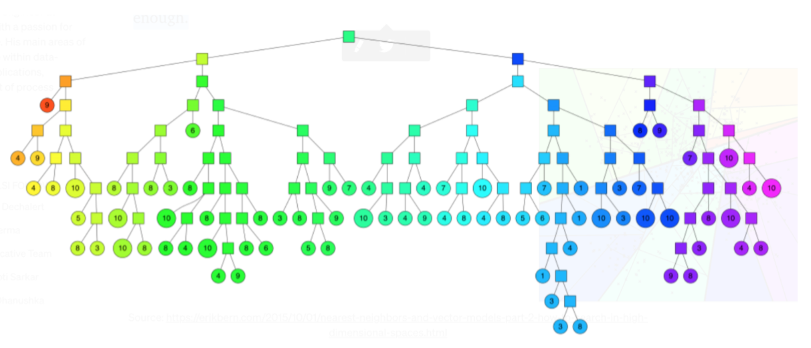

# Approximate Nearest Neighbor
____

**Overview**

- The idea of ANN is to search for points in space that are close to a given query point
  - Recommendation Engines
  - Search/Ranking

**Why ANN?**
- For finding k nearest neighbors in a vector space, it has linear complexity
  via brute force in the  number of indexed documents and can be extremely
  costly, compute wise because the retrieved results are exact.
- Instead, we can approximate results retrieved in sub-linear time.

### ANNOY
- Spotify developed an open-source library “ANNOY” which helps the team search
  millions of tracks in a  high dimensional space for similar users/items/
- ANNOY is a python package that uses a random hyperplane splitting approach to
  build up a forest of  search trees to efficiently calculate the nearest
  neighbours.
- Annoy has the ability to use static files as indexes which means you can share index across processes and the indexes can be loaded into memory very quickly. 
- An n index is built with a forest of k trees, where “k” is a tunable parameter that trades off between precision and performance.

**How does it work:**
- In order to construct the index a forest is created (aka many trees). 
- Each binary tree is constructed in the following way: 
	- 1.) We pick two points at random and split the space into two by their hyperplane 
    - 2.) We keep splitting in the subspaces recursively until the points
      associated with a node are  small enough.
    - 3.) We end up with a binary tree that partitions the space. The nice
      thing is that points that are close to each other in space are more
      likely to be close to each other in the tree.
- In other words: if two points are close to each other in space, it's unlikely
  that any hyperplane will cut them apart.
- To search for any point in this space, we can traverse the binary tree from the root. 
- Every intermediate node (the small squares in the tree above) defines a
  hyperplane, so we can figure out what side of the hyperplane we need to go
  on and that defines if we go down to the left or right child node. 
- Searching for a point can be done in logarithmic time since that is the height of the tree.

**Similarity Query**
- Example of using `Word2Vec` with `ANNOY` to understand context of query
- **Reference**: https://markroxor.github.io/gensim/static/notebooks/annoytutorial.html

