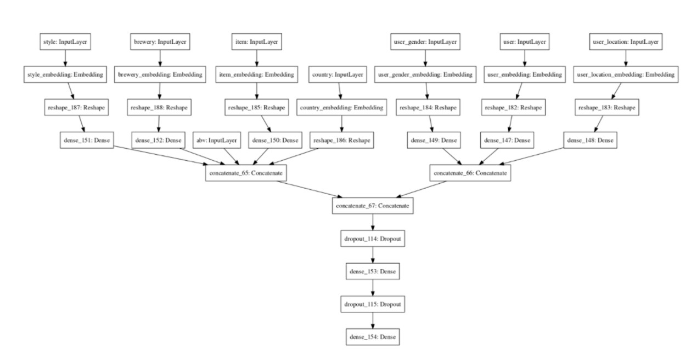
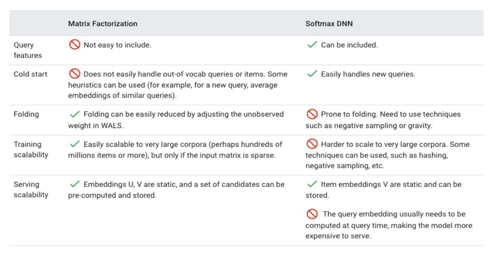
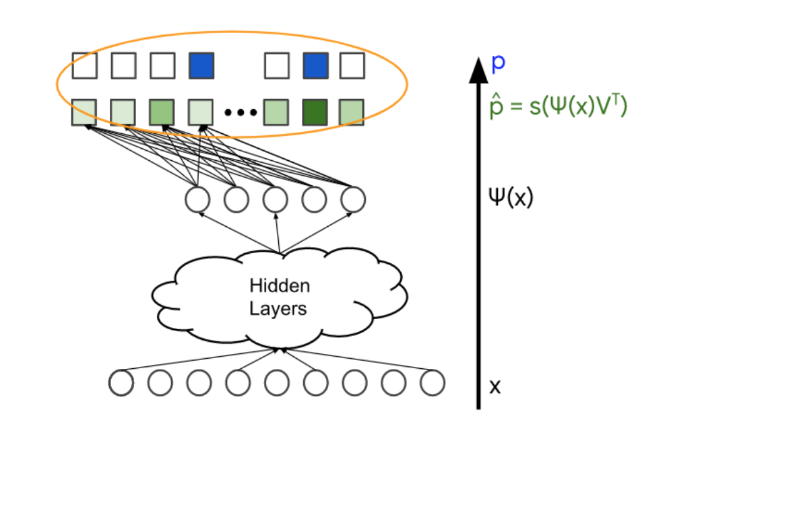
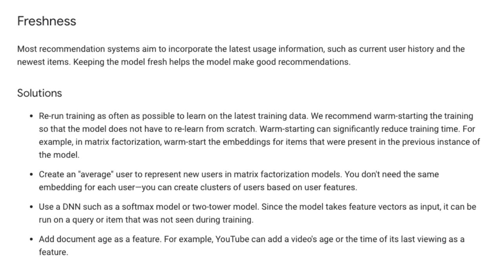
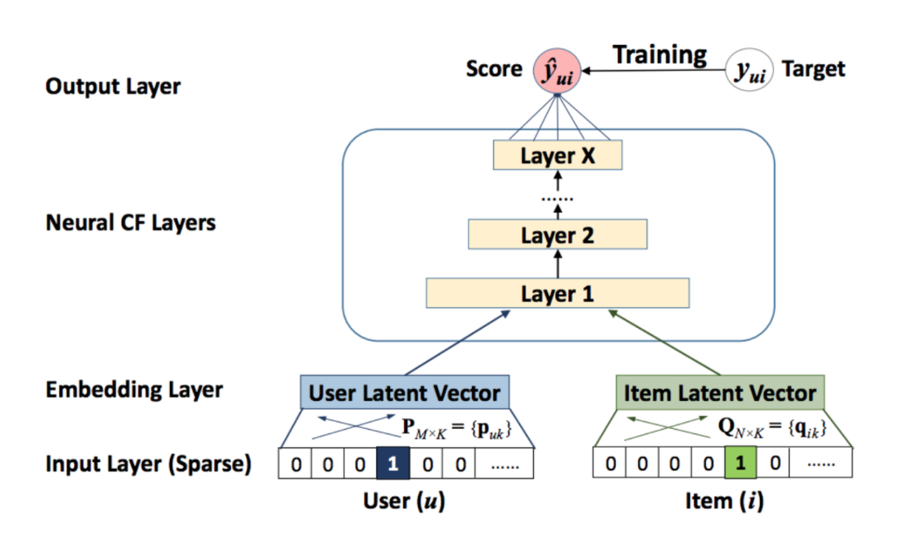
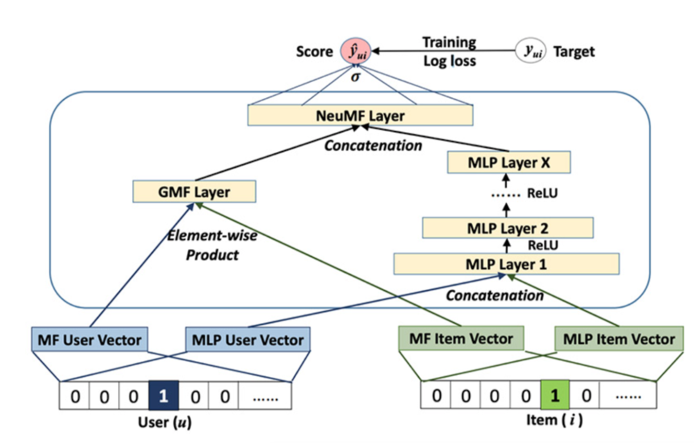

# Deep Neural Networks (RecSys)
____

**Overview**
- Deep neural network (DNN) models can address these limitations of matrix factorization.
- By adding hidden layers and non-linear activation functions (for example,
  ReLU), the model can capture more complex relationships in the data.
- DNNs can easily incorporate query features and item features (due to the
  flexibility of the input layer of the network), which can help capture the
  specific interests of a user and improve the relevance of recommendations.

**Matrix Factorization vs DNN**
- In both the softmax model and the matrix factorization model, the system
  learns one embedding vector `Vj` per item `j`. 
- What is called the item embedding matrix in matrix factorization is
  now the matrix of weights of the softmax layer.
- The query embeddings, however, are different. 
- Instead of learning one embedding Ui per query i, the system learns a mapping
  from the query feature x to an embedding space.
- Therefore, you can think of this DNN model as a generalization of matrix
  factorization, in which you replace the query side by a `nonlinear function`.
- DNN models solve many limitations of Matrix Factorization, but are typically
  more expensive to train and query. 

### SoftMax Model
- One possible DNN model is softmax, which treats the problem as a multiclass
  prediction problem in which:
- The input is the user query.
- The output is a probability vector with size equal to the number of items in
  the corpus, representing the probability to interact with each item; for
  example, the probability to click on or watch a YouTube video.
- **Inputs:**
  - dense features (for example, watch time and time since last watch)
  - sparse features (for example, watch history and country)
 
**Note:** You can think of this DNN model as a generalization of matrix
factorization, in which you replace the query side by a nonlinear function

### Embedding Layers
- Embedding layers is a relatively low-dimensional space into which you can
  translate high-dimensional vectors.
- Embeddings make it easier to do machine learning on large inputs like sparse vectors. 
- Embedding can basically be thought of as look-up tables
- Embedding layers capture some of the semantics of an input by placing
  semantically similar inputs close together in the embedding space. 
______

### Candidate Generator Model 
- In this first stage, the system starts from a potentially huge corpus and
  generates a much smaller subset of candidates. 
- It is about selecting an initial set of hundreds of candidates from all
  possible candidates. The  main objective of this model is to efficiently weed
  out all candidates that the user is not interested in
- For example, the candidate generator in YouTube reduces billions of videos
  down to hundreds or thousands. 
- The model needs to evaluate queries quickly given the enormous size of the corpus. 
- A retrieval system is a model that predicts a set of movies from the
  catalogue that the user is likely to watch. So the train set should be
  expressing which movies the users watched, and which they did not.
- The similarity between the query representation (query embedding vector) and
  the candidate representation (candidate embedding vector) a.k.a. affinity
  score can be calculated by dot-product (or other similarity measures). The
  K-nearest candidates (candidates with higher affinity scores) will be chosen
  for the final list.
- Let’s say in our training data we only have positive (user, items) pairs. 
- To figure out how good our model is, we need to compare the affinity score
  that the model calculates for this positive pair to the scores of all the
  other possible candidates
- If the score for the positive pair is higher than for all other possible
  candidates, our model is highly accurate.
- To measure the performance of a retrieval task, `factorized top-K
  categorical` accuracy metrics over a corpus of candidates can be used. These
  metrics measure how good the model is at picking the true candidate out of
  all possible candidates in the system.

**Metrics**
- **factorized_top_k.TopK**: which computes the top K categorical accuracy.
- How often is the true candidate in the top K candidates for a given query?
- As the model trains, the top-k retrieval metrics updates. 
- The factorized_top_k retrieval metric measures the number of true positive
  that are in the top-k  retrieved items from the entire candidate set. 
- **Example**: a top-5 categorical accuracy metric of 0.2 would tell us that,
  on average, the true  positive is in the top 5 retrieved items 20% of the
  time.
  
To compute the nearest neighbors in the embedding space, the system can
exhaustively score every potential candidate. 
  - Exhaustive scoring can be expensive for very large corpora, but you can use
    either of the following 
    strategies to make it more efficient.
  - If the query embedding is known statically (e.g. learned weights), the
    system can perform exhaustive scoring offline, precomputing and storing a
    list of the top candidates for each query. This is a common practice for
    related-item recommendation.

**Methods:**
  - Brute-Force 
  - ANN (Approximate Nearest Neighbor)

______

### Ranking Model 
- Finally, the system must take into account additional constraints for the final ranking.
- For example, the system removes items that the user explicitly disliked or
  boosts the score of fresher content. 
- Re-ranking can also help ensure diversity, freshness, and fairness.

**Diversity:** 
- If the system always recommends items that are "closest" to the query
  embedding, the candidates tend to be very similar to each other. This lack
  of diversity can cause a bad or boring user experience.

**TopK Categorical Accuracy**
- Calculates the percentage of records for which the targets Y_true are in the
  top K predictions  (Y_pred).
- We rank the Y_pred predictions in the descending order of probability values.
- If the rank of the Y_pred present in the index of Y_true is less than or equal to K, it is considered accurate.
- We then calculate TopK Categorical Accuracy by dividing the number of
  accurately predicted records by the total number of records.

______

### Neural Collaborative Filtering

- One drawback of using implicit feedback is that there is a natural scarcity
  for negative feedback. 
- By employing a probabilistic treatment, NCF transforms the recommendation
  problem to a binary classification problem
- To account for negative instances y- is uniformly sampled from the unobserved
  interactions. 
- NCF has 2 components GMF and MLP with the following benefitsGMF that applies
  the linear kernel to model user-item interactions like vanilla MF.
- MLP that uses multiple neural layers to layer nonlinear interactions
- NCF combines these models together to superimpose their desirable
  characteristics. NCF concatenates the output of GMF and MLP before feeding
  them into NeuMF layer.

**Things to know for Neural CF:**
- GMF/MLP have separate user and item embeddings. This is to make sure that
  both of them learn optimal  embeddings independently.
- GMF replicates the vanilla MF by element-wise product of the user-item vector.
- MLP takes the concatenation of user-item latent vectors as input.
- The outputs of GMF and MLP are concatenated in the final NeuMF(Neural Matrix
  Factorisation) layer. 

**Notes:**
- NCF is an example of multimodal deep learning as it contains data from 2
  pathways namely user and item.  
- The most intuitive way to combine them is by concatenation. 
- But a simple vector concatenation does not account for user-item interactions
  and is insufficient to model the collaborative filtering effect.
- To address this NCF adds hidden layers on top of concatenated user-item
  vectors(MLP framework), to learn user-item interactions. 
- This endows the model with a lot of flexibility and non-linearity to learn
  the user-item interactions. 
- This is an upgrade over MF that uses a fixed element-wise product on them.

