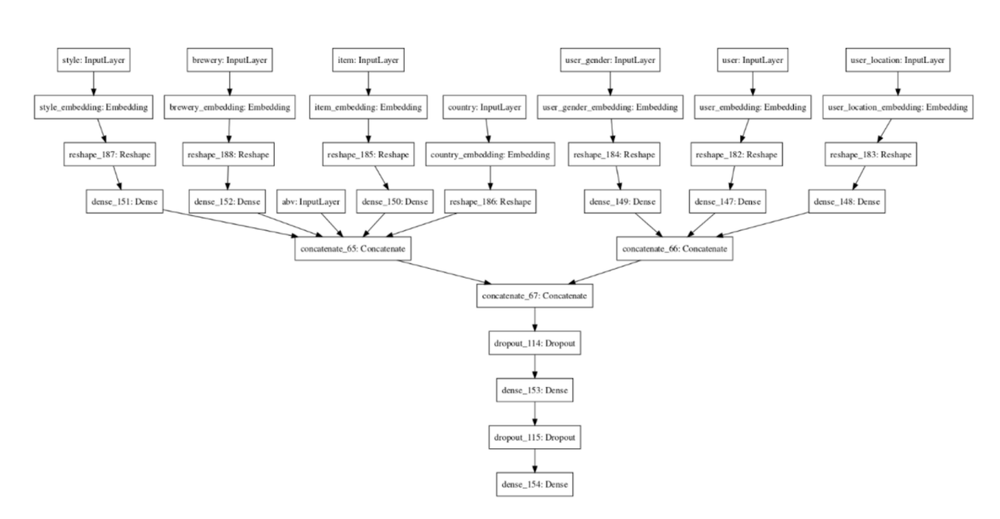
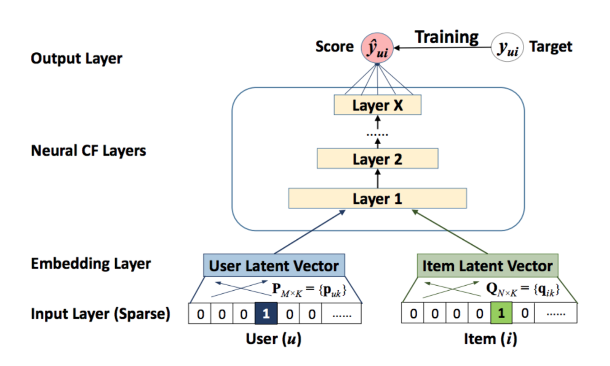

# Recommendation Engines
______

### Algorithms Overview

### Overview Diagram

### Content-based filtering 
- Content-based filtering uses item features to recommend other items similar to what the user likes, based on their previous actions or explicit feedback.
  
**Advantages vs Disadvantages**

### Collaborative Filtering
- Collaborative filtering uses similarities between users and items simultaneously to provide recommendations.
- Collaborative Filtering models can recommend an item to user A based on the interests of a similar user B. 
- In practice, the embeddings can be learned automatically without relying on hand-engineering of features, which is the power of collaborative filtering models.
- We can apply Matrix Factorization to identify the relationship between users and items entities. 
- **Data Sources**
  - **Explicit—** users specify how much they liked a particular movie by providing a numerical rating.
  - **Implicit—** if a user watches a movie, the system infers that the user is interested.

**Advantages vs Disadvantages** 

### Matrix Factorization

- The idea is to take the original user-item matrix, and then reduce that down to two much smaller matrices that approximates the original when multiplied together such that the loss between the multiplication of the two smaller matrices and the true user-item matrix is minimized (See Loss Functions Below)
- Matrix factorization algorithm tries to find latent factors that represent intrinsic user 
and item attributes in a lower dimension 
- With Matrix Factorization we can throw away having to come up with features that connect users and items and instead use the user-item data we have to 

### Loss Function

- The objective function is simply the sum of squared distances between predicted ratings and actual ratings, so this is what we need to minimize.
- Common algorithm to minimize the loss function is Stochastic Gradient Descent 

### Regularization
- But in order to prevent overfitting to the training data we need to constrain the learned values for our user and item features by penalizing high values. 
- We do this by multiplying the sum of the squares of the elements of the user and item matrices by a configurable regularization parameter and including this in our cost function. 

### Sparse Matrix
- The ratings matrix is sparse, meaning most of the values are 0, because each user has only rated a small number of items. 
- The concept of a sparse matrix can actually be translated to a different data structure that retains only information about the non-zero values, making it a much more memory-efficient representation of the same information. 
- One way is to define a vector of row indices, i, a vector of column indices, j, and a vector of values for each (i,j) pair. So only the (i,j) pairs that have values are included. Using this format, known as coordinate list or COO, the above ratings would be expressed as follows:

### Alternating Least Squares

- The latent factor terms in the loss function are non-convex and therefore Gradient descent method can be applied but this will be expensive computations.
- The ALS algorithm was developed to overcome this limitation.
- ALS is to learn one of ‘w’ and ‘f’ at a time for optimization while keeping the other as constant. This makes the objective at each iteration convex and solvable.
 

**Advantage:** 
- Can be parallelised and/or distributed, which makes the algorithm desirable for use cases where the dataset is large and thus the user-item rating matrix is super sparse.

**Implementation:**
- Scoring metric for explicit data: RMSE, MSE, R^2
- The recommended items should be different from those that have been rated by the users
- Prediction performance of a Spark ALS model is often affected by the parameters. 
 
### Implicit ALS
- Link: https://www.benfrederickson.com/matrix-factorization

### Evaluating Recommendation Engines

**Mean Average Precision (MAP)**
- MAP to evaluate a recommender algorithm implies that we are treating the recommendation like a ranking task. 
- We want to show the top recommendations first and maybe market them more aggressively.

**Coverage**
- Is the percent of items in the training data the model is able to recommend on a test set.

**Personalization** 
- Is a great way to assess if a model recommends many of the same items to different users. 
- We can use the cosine similarity metric to measure the similarity among the top “K” items recommended. 
- A high personalization score indicates user’s recommendations are different, meaning the model is offering a personalized experience to each user.

### Similarity Metrics

- **Dot Product:** note that popular items tend to be recommended for everyone, especially when using dot product as a similarity measure.

**Cosine Similarity**
- Cosine Similarity is a measurement that quantifies the similarity between two or more vectors.
 Range: `[0 - 1]`.

 

- The similarity measurement is a measure of the cosine of the angle between the two non-zero vectors A and B.
- As the cosine similarity gets closer to 1, the angle between the two vectors [A,B] is smaller. 
- Computes similarity as the normalized dot product of X and Y:

**Note:** In order to compute similarities, the entire dataset needs to be loaded into memory. One solution would be to convert from a dense to a sparse matrix representation given that many of the rows have zero entries. Using implementation sparse.csr_matrix can be used as it's very memory efficient for storing sparse datasets

### Deep Neural Networks
- Deep neural network (DNN) models can address these limitations of matrix factorization.
- By adding hidden layers and non-linear activation functions (for example, ReLU), the model can capture more complex relationships in the data.
- DNNs can easily incorporate query features and item features (due to the flexibility of the input layer of the network), which can help capture the specific interests of a user and improve the relevance of recommendations.

**Matrix Factorization vs DNN**
- In both the softmax model and the matrix factorization model, the system learns one embedding vector Vj per item j. 
- What is called the item embedding matrix V∈Rn×d in matrix factorization is now the matrix of weights of the softmax layer.
- The query embeddings, however, are different. 
- Instead of learning one embedding Ui per query i, the system learns a mapping from the query feature x to an embedding space
- Therefore, you can think of this DNN model as a generalization of matrix factorization, in which you replace the query side by a `nonlinear function`.
- DNN models solve many limitations of Matrix Factorization, but are typically more expensive to train and query. 

**SoftMax Model**
- One possible DNN model is softmax, which treats the problem as a multiclass prediction problem in which:
- The input is the user query.
- The output is a probability vector with size equal to the number of items in the corpus, representing the probability to interact with each item; for example, the probability to click on or watch a YouTube video.
- **Inputs:**
  - dense features (for example, watch time and time since last watch)
  - sparse features (for example, watch history and country)
 
**Note:** You can think of this DNN model as a generalization of matrix
factorization, in which you replace the query side by a nonlinear function

### Embedding Layers
- Embedding layers is a relatively low-dimensional space into which you can translate high-dimensional vectors.
- Embeddings make it easier to do machine learning on large inputs like sparse vectors. 
- Embedding can basically be thought of as look-up tables
- Embedding layers capture some of the semantics of an input by placing semantically similar inputs close together in the embedding space. 

### Candidate Generator Model 
- In this first stage, the system starts from a potentially huge corpus and generates a much smaller subset of candidates. 
- It is about selecting an initial set of hundreds of candidates from all possible candidates. The main objective of this model is to efficiently weed out all candidates that the user is not interested in
- For example, the candidate generator in YouTube reduces billions of videos down to hundreds or thousands. 
- The model needs to evaluate queries quickly given the enormous size of the corpus. 
- A retrieval system is a model that predicts a set of movies from the catalogue that the user is likely to watch. So the train set should be expressing which movies the users watched, and which they did not.
- The similarity between the query representation (query embedding vector) and the candidate representation (candidate embedding vector) a.k.a. affinity score can be calculated by dot-product (or other similarity measures). The K-nearest candidates (candidates with higher affinity scores) will be chosen for the final list.
- Let’s say in our training data we only have positive (user, items) pairs. 
- To figure out how good our model is, we need to compare the affinity score that the model calculates for this positive pair to the scores of all the other possible candidates
- If the score for the positive pair is higher than for all other possible candidates, our model is highly accurate.
- To measure the performance of a retrieval task, `factorized top-K categorical` accuracy metrics over a corpus of candidates can be used. These metrics measure how good the model is at picking the true candidate out of all possible candidates in the system.

**Metrics**
- **factorized_top_k.TopK**: which computes the top K categorical accuracy.
- How often is the true candidate in the top K candidates for a given query?
- As the model trains, the top-k retrieval metrics updates. 
- The factorized_top_k retrieval metric measures the number of true positive that are in the top-k retrieved items from the entire candidate set. 
- **Example**: a top-5 categorical accuracy metric of 0.2 would tell us that, on average, the true positive is in the top 5 retrieved items 20% of the time.
  
To compute the nearest neighbors in the embedding space, the system can exhaustively score every potential candidate. 
  - Exhaustive scoring can be expensive for very large corpora, but you can use either of the following
    strategies to make it more efficient.
  - If the query embedding is known statically (e.g. learned weights), the system can perform exhaustive scoring offline, precomputing and storing a list of the top candidates for each query. This is a common practice for related-item recommendation.

**Methods:**
  - Brute-Force 
  - ANN (Approximate Nearest Neighbor)

### Ranking Model 
- Finally, the system must take into account additional constraints for the final ranking.
- For example, the system removes items that the user explicitly disliked or boosts the score of fresher content. 
- Re-ranking can also help ensure diversity, freshness, and fairness.

**Diversity:** 
- If the system always recommends items that are "closest" to the query embedding, the candidates tend to be very similar to each other. This lack of diversity can cause a bad or boring user experience.

**TopK Categorical Accuracy**
- Calculates the percentage of records for which the targets Y_true are in the top K predictions (Y_pred).
- We rank the Y_pred predictions in the descending order of probability values.
- If the rank of the Y_pred present in the index of Y_true is less than or equal to K, it is considered accurate.
- We then calculate TopK Categorical Accuracy by dividing the number of accurately predicted records by the total number of records.

### Neural Collaborative Filtering

- One drawback of using implicit feedback is that there is a natural scarcity for negative feedback.
- By employing a probabilistic treatment, NCF transforms the recommendation problem to a binary classification problem
- To account for negative instances y- is uniformly sampled from the unobserved interactions.
- NCF has 2 components GMF and MLP with the following benefitsGMF that applies the linear kernel to model user-item interactions like vanilla MF.
- MLP that uses multiple neural layers to layer nonlinear interactions
- NCF combines these models together to superimpose their desirable characteristics. NCF concatenates the output of GMF and MLP before feeding them into NeuMF layer.

**Things to know for Neural CF:**
- GMF/MLP have separate user and item embeddings. This is to make sure that both of them learn optimal embeddings independently.
- GMF replicates the vanilla MF by element-wise product of the user-item vector.
- MLP takes the concatenation of user-item latent vectors as input.
- The outputs of GMF and MLP are concatenated in the final NeuMF(Neural Matrix Factorisation) layer.

**Notes:**
- NCF is an example of multimodal deep learning as it contains data from 2 pathways namely user and item. 
- The most intuitive way to combine them is by concatenation. 
- But a simple vector concatenation does not account for user-item interactions and is insufficient to model the collaborative filtering effect.
- To address this NCF adds hidden layers on top of concatenated user-item vectors(MLP framework), to learn user-item interactions. 
- This endows the model with a lot of flexibility and non-linearity to learn the user-item interactions. 
- This is an upgrade over MF that uses a fixed element-wise product on them.

### Approximate Nearest Neighbor
- The idea of ANN is to search for points in space that are close to a given query point
  - Recommendation Engines
  - Search/Ranking

**Why ANN?**
- For finding k nearest neighbors in a vector space, it has linear complexity via brute force in the number of indexed documents and can be extremely costly, compute wise because the retrieved results are exact.
- Instead, we can approximate results retrieved in sub-linear time.

**ANNOY**
- Spotify developed an open-source library “ANNOY” which helps the team search millions of tracks in a high dimensional space for similar users/items/
- ANNOY is a python package that uses a random hyperplane splitting approach to build up a forest of search trees to efficiently calculate the nearest neighbours.
- Annoy has the ability to use static files as indexes which means you can share index across processes and the indexes can be loaded into memory very quickly. 
- An n index is built with a forest of k trees, where “k” is a tunable parameter that trades off between precision and performance.

**How does it work:**
- In order to construct the index a forest is created (aka many trees). 
- Each binary tree is constructed in the following way: 
	- 1.) We pick two points at random and split the space into two by their hyperplane 
	- 2.) We keep splitting in the subspaces recursively until the points associated with a node are small enough.
	- 3.) We end up with a binary tree that partitions the space. The nice thing is that points that are close to each other in space are more likely to be close to each other in the tree.
- In other words: if two points are close to each other in space, it's unlikely that any hyperplane will cut them apart.
- To search for any point in this space, we can traverse the binary tree from the root. 
- Every intermediate node (the small squares in the tree above) defines a hyperplane, so we can figure out what side of the hyperplane we need to go on and that defines if we go down to the left or right child node. 
- Searching for a point can be done in logarithmic time since that is the height of the tree.

**Similarity Query**
- Example of using `Word2Vec` with `ANNOY` to understand context of query
- **Reference**: https://markroxor.github.io/gensim/static/notebooks/annoytutorial.html

