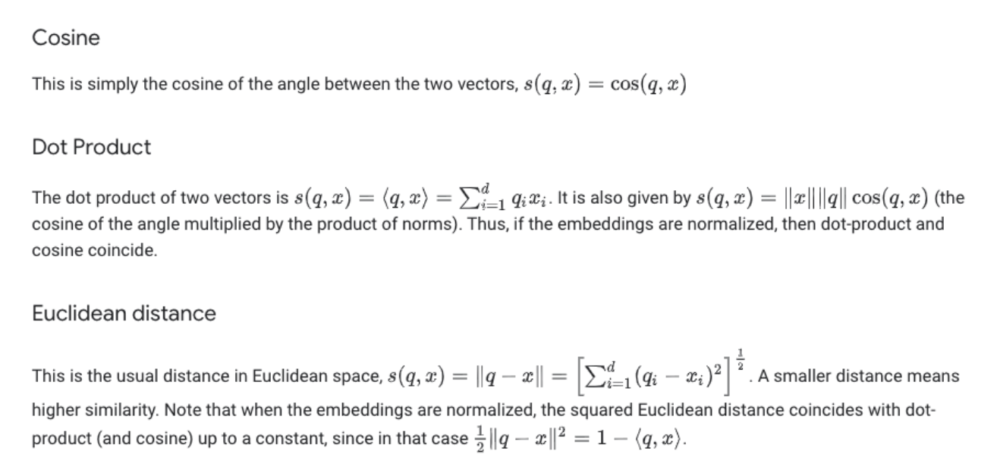

# Evaluate RecSys
_____

# Similarity Metrics

**Dot Product:** 
- Note that popular items tend to be recommended for everyone, especially when using dot product as a similarity measure.

**Cosine Similarity**
- Cosine Similarity is a measurement that quantifies the similarity between two or more vectors.
 Range: `[0 - 1]`.

 

- The similarity measurement is a measure of the cosine of the angle between the two non-zero vectors A and B.
- As the cosine similarity gets closer to 1, the angle between the two vectors [A,B] is smaller. 
- Computes similarity as the normalized dot product of X and Y:

**Note:** In order to compute similarities, the entire dataset needs to be
loaded into memory. One solution would be to convert from a dense to a sparse
matrix representation given that many of the rows have zero entries. Using
implementation sparse.csr_matrix can be used as it's very memory efficient for
storing sparse datasets

## Mean Average Precision (MAP)
- MAP to evaluate a recommender algorithm implies that we are treating the recommendation like a ranking task. 
- We want to show the top recommendations first and maybe market them more aggressively.

## Coverage
- Is the percent of items in the training data the model is able to recommend on a test set.

## Personalization
- Is a great way to assess if a model recommends many of the same items to different users. 
- We can use the cosine similarity metric to measure the similarity among the top “K” items recommended. 
- A high personalization score indicates user’s recommendations are different, meaning the model is offering a personalized experience to each user.

