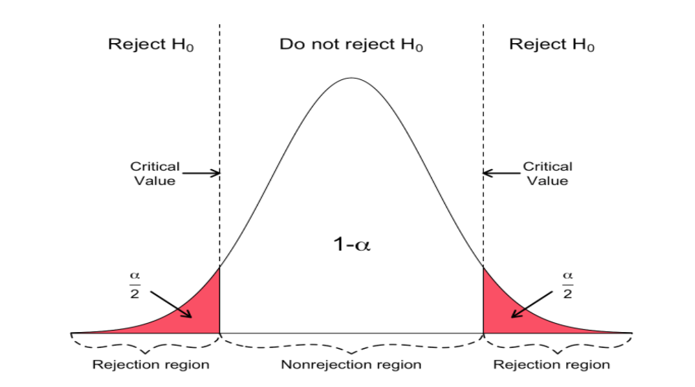
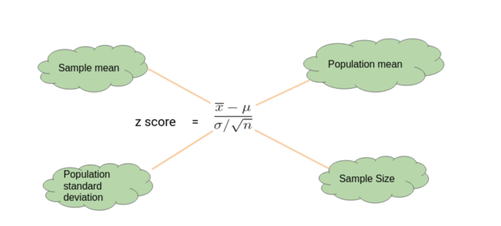
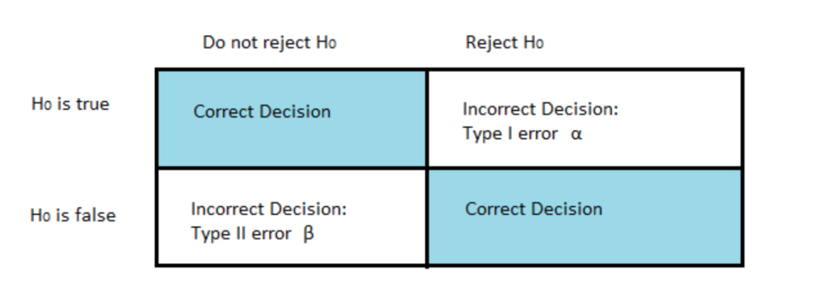

# Statistics 
__________

## P-Value

- Statistically significant is detected when the observed p-value from the test statistic is less than the level of significance (i.e. alpha). 
- Meaning, there is a very low probability of observing by random chance something as extreme or more extreme than what was observed under the assumption that the null hypothesis is true.

```
P-Value < 0.05 = Reject null hypothesis; 
P-Value > 0.05 = Fail to reject null hypothesis; 
```



**Note:** If we reject the null hypothesis, this indicates strong statistical significance. 
 
 
## Z-Test

- The one-sample z-test is used to test whether the mean of a population is greater than, less than, or not equal to a specific value.
- For large (50 or more observations) normally distributed samples, normal distribution tests **are equivalent to the T-Test**.

**Requirements for the Z-test:**

- The mean and standard deviation of the population distribution are known
- The mean of the sample distribution is known
- The variance of the sample is assumed to be the same as the population
- The population is assumed to be normally distributed





## T-Test
- Statistical test that is used to compare the means of two groups. 
- When the original (population) distribution is not normal, the one sample t-test is still valid with a large enough sample size. 
- We perform a **One-Sample t-test** when we want to compare a sample mean with the population mean. 
- The difference from the Z Test is that we do not have the information on Population Variance here. 
- We use the sample standard deviation instead of population standard deviation in this case.

**One-Sample T-Test:**

- Robust to the normality assumption when the sample size is large enough. Assumptions must be met:  
- Samples are drawn from a Gaussian Distribution
- If a two-sample test, both populations are assumed to have the same standard deviation 
Observations in the sample are independent of one another

**Rules of Thumb in Evaluating Assumptions:**

- If sample sizes are the same and sufficiently large, the t-tools are valid since they are robust to the violation of normality.
- If the two populations have the same standard deviation then the t-tests are valid given sufficient sample sizes.
- If the standard deviations are different and the sample sizes are different, then the t-tools are not valid and another procedure should be used.

**Transformations**

- If assumptions are not met, look at transforming the data such as taking the logarithmic transformation.

## Statistical Power

- A power test will tell us how many samples we will need to collect to have a good amount of statistical power.
- It tells you how many trials you need to do to avoid incorrectly rejecting the null hypothesis

```
Power = Type II Error = fail to reject a false null hypothesis. 
```

- Power is the probability of not making a Type II error. 
 
- Power = the probability that we correctly reject the null hypothesis (e.g. small p-value). or “the probability of rejecting a null hypothesis when it is false” 
 
- Low Power = when there is a lot of over lap between the two distributions and we have a small sample size, we have low power. 
 
- When we have a lot of power, there is a higher probability that we will correctly reject the null hypothesis. 
 


## ANOVA

- Statistical technique that is used to check if the means of two or more groups are significantly different from each other. 

**Assumptions:**
- Normality: 
	- Similar to Hypothesis Testing, ANOVA is robust to this assumption.  
	- Extremely long-tailed distributions (outliers) or skewed distributions coupled with different sample sizes (especially when the sample sizes are small) present the only serious distributional problems.
- Equal Standard Deviations: 
	- This assumption is crucial, paramount, VERY important.
	- The assumptions of independence within and across groups are critical.  
	- If lacking, different analysis should be attempted.   

## F-Test
- Hypothesis test to check if Evidence of Inequality of Variance

## Central Limit Theorem
- The distribution of sample x’s will, as the sample size increases, approach a normal distribution.
- The mean (x) of the sample means is the population mean µ.
- The standard deviation of the distribution of sample means is sigma/sqrt(n)

## Confidence Interval
- A 95% confidence interval means that if we were to take 100 different samples and compute a 95% confidence interval for each sample, then approximately 95 of the 100 confidence intervals will contain the true mean value. 

```
CI = mean += Z * sigma / sqrt(n)
```

## Multicollinearity 

- Occurs whenever an independent variable is highly correlated with one or more
  of the other independent variables in a multiple regression equation. 

- **Problem:** An independent variable that is very highly correlated with one or more other independent variables will have a relatively large standard error. 
- This implies that the partial regression coefficient is unstable and will vary greatly from one sample to the next.
 
- Multicollinearity can also be detected with the help of tolerance and its reciprocal, called variance inflation factor (VIF). A VIF >= 10 is problematic.