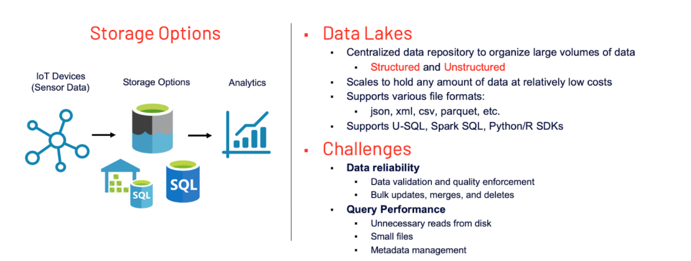
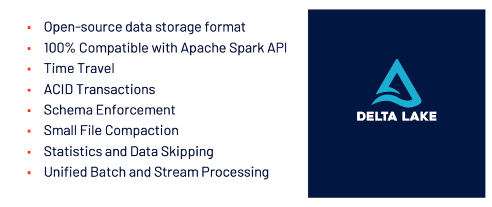

# Data Stores
_______

### Data Storage

- Solution to Data Challenges of a Data Lake → Delta Lakes



### Delta Lakes


- Delta stores a transaction log to keep track of all the commits made to the table directory to provide ACID transactions 
- ACID = atomicity, consistency, isolation, durability
- Also enables schema enforcement, by helping to avoid bad data getting your data lakes by providing the ability to specify the schema. 
- Supports schema evolution like adding a new column.
- Handles Unified Batch and Stream Processing.
- If we have a use-case of both Stream processing and Batch processing it is normal to follow `Lambda Architecture`.
 Data coming in as Stream or any historical data you have is the same table being updated.




**Z-Ordering**
- is a technique to colocate related information in the same set of files. Z-ordering is basically a data-skipping algorithm to dramatically reduce the amount of data that needs to be read. 
- To Z-Order data, you specify the columns to order on in the `ZORDER BY `clause:

```
OPTIMIZE events
WHERE date >= current_timestamp() - INTERVAL 1 day
ZORDER BY (eventType)
```

### Partition Strategy
- You can partition a Delta table by a column. 
- The most commonly used partition column is date.
- If the cardinality of a column will be very high, do not use that column for partitioning.
- For example, if you partition by a column userId and if there can be 1M distinct user IDs, then that is a bad partitioning strategy.
- Amount of data in each partition: You can partition by a column if you expect data in that partition to be at least 1 GB.

**Data Compaction:** 
- If you continuously write data to a Delta table, it will over time accumulate a large number of files, especially if you add data in small batches. 
- This can have an adverse effect on the efficiency of table reads, and it can also affect the performance of your file system. Ideally, a large number of small files should be rewritten into a smaller number of larger files on a regular basis. 
- This is known as `compaction`.
- You can compact a table by repartitioning it to a smaller number of files.

### Data Serialization
- Serialization is the process of converting an object into a stream of bytes to store the object or transmit it to memory, a database, or a file. 
- Its main purpose is to save the state of an object in order to be able to recreate it when needed. The reverse process is called deserialization.
- Serialization is the process of converting an object into a stream of bytes to store the object or transmit it to memory, a database, or a file. 
- Its main purpose is to save the state of an object in order to be able to recreate it when needed. The reverse process is called deserialization.

### Data Warehouse
- A database designed to store and process large volumes of current and
  historical data collected from multiple sources inside and outside the
  enterprise for deep analysis. 
- Organizes data into tables and columns, and allows users access via SQL.
- Optimized for loading, integrating and analyzing very large amounts of data.
- Designed to support descriptive, diagnostic, predictive and prescriptive
  analytic workloads. 
- **Example**: Snowflake 