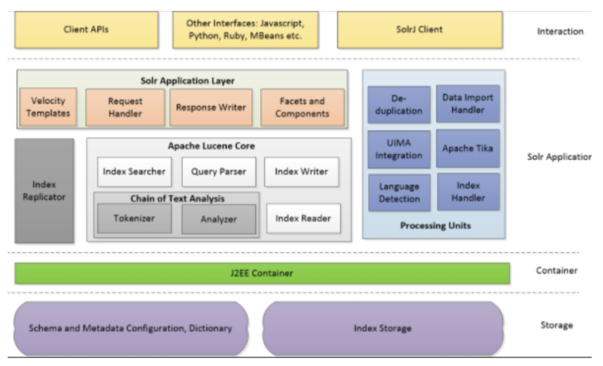
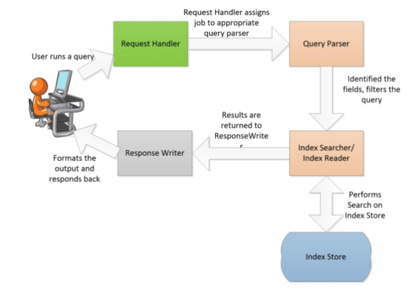

# Distributed Databases 
______

### Master + Slave
- Master-slave is a way to optimize the I/O in your application other than
  using caching.  
- The master database serves as the keeper of most current information.
- The true data is kept at the master database, thus writing only occurs there.
- Reading is only done in the slave. 
- Master is the true data keeper while a slave is a replication of master.
- This architecture serves the purpose of safeguarding site reliability. 
- If a site receives a lot of traffic and the only available database is one
  master, it will be overloaded with reading and writing requests. 
- Making the entire system slow for everyone on the site.

### Sharding 
- Is the process of making partitions of data in a database or search engine,
  such that the data is divided into various smaller distinct chunks, or
  shards. 
- Sharding results in less read and write traffic, less replication, and more cache hits.
- Index size is also reduced, which generally improves performance with faster queries. 
- Common approach is performing horizontal sharding.  
- For example, you can take a tweets table and shard by User ID (Number of User
  Ids  % mod Number of Database Master Servers). 

Distadvantages
- You'll need to update your application logic to work with shards, which could
result in complex SQL queries. 
- Data distribution can become lopsided in a shard. For example, a set of power
users on a shard could result in increased load to that shard compared to
others. 
- Rebalancing adds additional complexity. A sharding function based on consistent
hashing can reduce the amount of transferred data. 
- Joining data from multiple shards is more complex.
- Sharding adds more hardware and additional complexity.

### Apache Solr 
- Solr is highly reliable, scalable and fault tolerant, providing distributed
  indexing, replication and load-balanced querying; it is a client-server
  model. 
- Apache Solr can run in a master-slave mode. 
- Index replicator is responsible for distributing indexes across multiple slaves. 
- The master server maintains index update and the slaves are responsible for
  talking with the master to get them replicated for high availability. 
- Internally uses `Apache Lucene` libraries to generate the indexes as well as
  to provide a user friendly search.

**Four logical layers of Solr:**
- **Storage layer:** is responsible for management of indexes and configuration
  metadata. It is typically a file store, locally configured in the
  configuration of Apache Solr. 
- **Container**: java based container on which the instance will run
- **Solr Application:** is the application package that runs on top of the container.
  - Solr supports—indexing and searching.  
  - Initially, the data is uploaded to Apache Solr through various means; there
  are handlers to handle data within specific category (XML, CSV, PDF, database, and so on)
- **Query parser:** is responsible for parsing the queries, and converting it
  to Lucene query objects. 
  - Tokenizer breaks field data into lexical units or tokens.  
  - Interaction: refers to how clients/browser can interact with Apache Solr server. 

**Reference**: https://subscription.packtpub.com/book/big-data-and-business-intelligence/9781783981748/1/ch01lvl1sec11/apache-solr-architecture

**Solr Terms**
- **Document**:  is a set of data that describes something. 
- **Fields**: documents are composed of fields, which are more specific pieces
  of information. Fields can contain different kinds of data. 
- Solr’s schema is a single file (in XML) that stores the details about the
  fields and field types Solr is expected to understand.  
- The schema defines not only the field or field type names, but also any
  modifications that should happen to a field before it is indexed. 

**Index**
- When you add a document, Solr takes the information in the document’s fields
  and adds that information to an index.  
- The index stores statistics about terms in order to make term-based search
  more efficient.  
- Lucene's Index (inverted index family): when lucene indexes a document it
  breaks it down into a number of terms.  
- It then stores the terms in an index file where each term is associated with
  the documents that contain it.  
- You could think of it as a bit like a hashtable. 

**Lucene**
- Stackoverflow Answer on Lucene
https://stackoverflow.com/questions/2602253/how-does-lucene-index-documents
- In reality of course things are more complicated:
- Lucene may skip some words based on the particular Analyzer given;
  words can be preprocessed using stemming algorithm to reduce flexia of the
  language. 
- It's important to understand though, that the Lucene index is append only. 
- In some point in time the application decides to commit (publish) all the
  changes in the index.  
- Lucene finishes all service operations with index and closes it, so it's
  available for searching.  
- After commit index basically immutable. 
- This index (or index part) is called segment. 
- When Lucene executes a search for a query it searches in all available segments.
- So the question arises – how can we change an already indexed document?
- New documents or new versions of already indexed documents are indexed in new
  segments and old versions invalidated in previous segments using the
  so-called kill list.  
- Kill list is the only part of committed index which can change.
- As you might guess, index efficiency drops with time, because old indexes
  might contain mostly removed documents. 
- This is where merging comes in. 
- Merging – is the process of combining several indexes to make an index more
  efficient overall.  
- What is basically happens during merge is live documents copied to the new
  segment and old segments removed entirely. 

