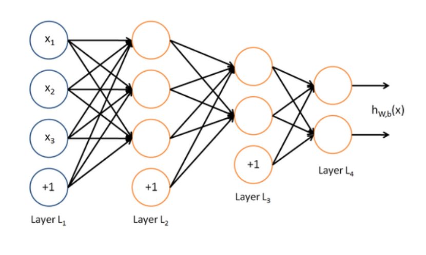
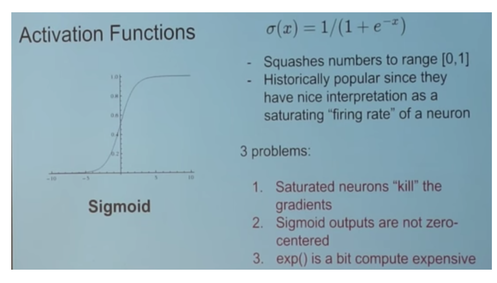
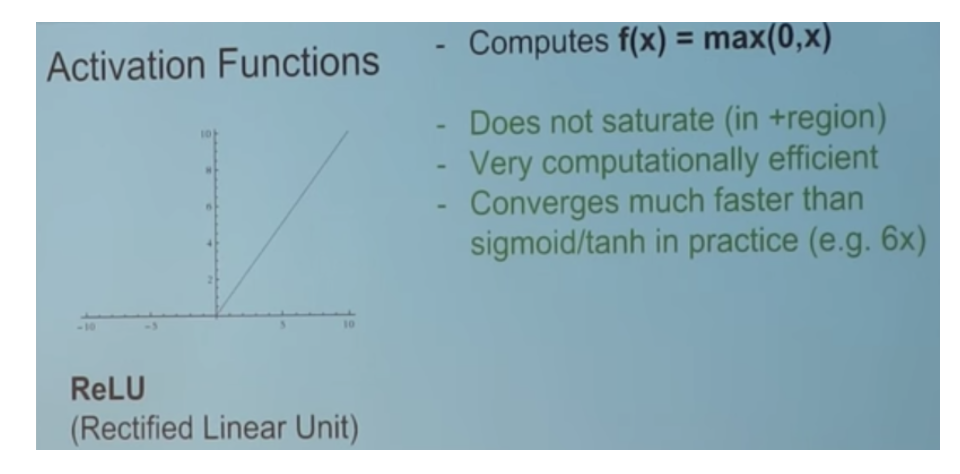
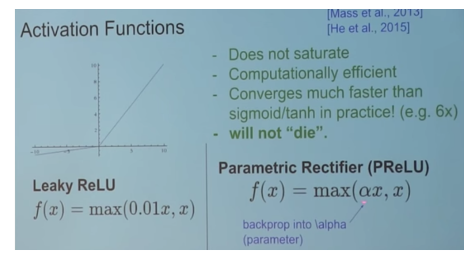
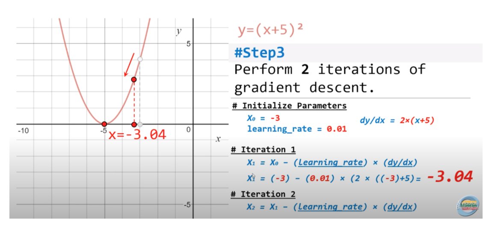
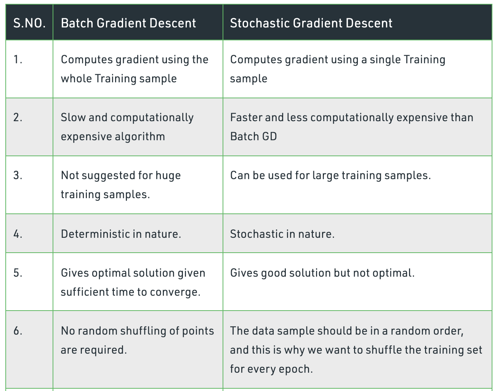

# Deep Learning
______

### Feed Forward Neural Networks

**Steps**

- **Feed Forward:** takes an input and passes it through multiple layers of hidden
  neurons and outputs a prediction representing the combined input of all the
  neurons.
- **Input Layer:** consists of the input data which is passed to
  the first hidden layer in the network. Each layer in the network consists of
  a series of neurons. 
  - A `Neuron` is the weighted sum of the inputs plus bias and then feeds the sum
  through a non-linear activation function. 
  - The outputs of the neurons are then passed to the next layer. 
  - This process is repeated for each layer in the network until the output layer. 
- **Hidden Layers:** resides in-between input and output layers and can consist
  of ‘n’ layers (hyperparameter to tune for). 
  - As the number of hidden layers in the network increases, so does the
    training time.
- **Output layer:**: produces the class label or target, depending whether this
  is a classification or regression task.

**Goal**
- The objective is to `minimize` the Loss Function.
- Where the loss function quantifies how “good” or “bad” a given model is in
  classifying the input  data 

**Backpropagation**: 
- Back prop is the method to update the weights in the neural network by taking
  into account the actual output and the desired output.  
- The backward pass adjusts the weights and biases in the network
  to optimize the cost function and minimize the loss function. 
- The derivative with respect to the weights is computed using chain rule. 

### Activation Functions 

- Functions used at the end of a hidden unit to introduce non-linear
  complexities to the model.
- **Reference**: Andrej Karpathy |CS231n Winter 2016: Lectures on Convolutional
  Neural Nets 
  - [Link](https://www.youtube.com/watch?v=NfnWJUyUJYU&list=PLkt2uSq6rBVctENoVBg1TpCC7OQi31AlC)

**Sigmoid Function (Logistic Function)**

- In order to map predicted values to probabilities, we use the sigmoid
  function. The function maps  any real value into another value between 0 and
  1. In machine learning, we use sigmoid to map predictions to probabilities.

**Tanh**

**Relu**

**Leaky Relu**

### Dropout
- Is a technique meant to prevent overfitting the training data by dropping out
  units in a neural network. In practice, neurons are either dropped with
  probability.

### Epoch
- Epoch is a term used to refer to one iteration where the model sees the whole
  training set to update its weights.

### Gradient Descent
- Gradient descent is an `iterative algorithm`, that starts from a random point on
a function and travels down its slope in steps until it reaches the lowest
point of that function. 
- Gradient Descent involves calculating the `gradient` of the target function.
- Optimization algorithm used to minimize the loss function by iteratively
  moving in the direction of steepest descent as defined by the negative of
  the gradient. 
  - **Derivative**: Slope or curvature of a target function with respect to
    specific input values to the function. 
  - **Gradient**: Vector of partial derivatives of a target function with
    respect to input variables. 
  - **Step Size:** Learning rate or alpha, a hyperparameter used to control
    how much to change each input variable with respect to the gradient.
- Shape of the loss function:
  - **Linear Models:** convex shape
  - **Non-Linear Models:** non-convex optimization (needs GPU)

**Steps**
- Calculate gradients of the loss/error function, then updating existing
  parameters in response to the gradients.
- This new gradient tells us the slope of our cost function at our current
  position and the direction we should move to update our parameters. 
- The size for updating the weights is controlled by the learning rate.
  - `step size = gradient * learning rate`
- Calculate the new parameters as:
  -  `new params = old params -step size`
- Repeat until convergence (e.g. gradient is small enough to stop).

**Disadvantages**
- For large datasets, the gradient descent algorithm can be slow. 
- An alternative is to use a stochastic gradient descent algorithm (SGD) which
  is faster and more efficient.

### Batch Gradient Descent
- Same as vanilla gradient descent and computes the gradient of the cost
  function with respect to the parameters for the entire dataset. 
- During batch gradient descent, the algorithm has to scan every single
  instance of the training set before taking a single step, which can take
  longer to compute, especially for larger datasets.
- Batch Gradient Descent is not often used in practice as it's simply too
  computationally expensive. 

### Stochastic Gradient Descent
- Stochastic gradient descent (SGD) is the dominant method used to train deep
  learning models. 
- While selecting data points at each step to calculate the derivatives, SGD
  `randomly` picks *one data point* from the whole data set at each iteration. 
- Often the case, SGD performs much faster than batch gradient descent as moves
  closer to the minimum quicker. 
- Given that SGD computes the gradient using a single sample. - single samples
  are really noisy. 
  - Fluctuation enables it to jump to new and potentially better local
  minima and converge quicker.

### Mini-batch Gradient Descent 
- Takes the best of both worlds (batch and stochastic) and performs an update
  for every mini-batch of `n` training examples.
- Mini-batches tend to average a little of the noise out relatively to using
  just SGD. 
- A good balance is struck when the mini-batch size is small enough to avoid
  some of the poor local minima, but large enough that it doesn't avoid the
  global minima or better-performing local minima.

### Stochastic Gradient Descent vs. Batch Gradient Descent

[Reference](https://www.geeksforgeeks.org/difference-between-batch-gradient-descent-and-stochastic-gradient-descent/)

### Stochastic Weighting Average
- Stochastic weighting is a technique that allows us to update the weights of
  the network in a way that is more efficient than the traditional way.
- **Reference**: https://pytorch.org/blog/stochastic-weight-averaging-in-pytorch/
  
### Softmax 
- In a neural network, the raw predictions are produced from the last layer of
  the network. The softmax function converts these values to probabilities for
  multi-class labels. 

### Learning Rate
- Controls how much to change the model in response to the estimated error each
  time the model weights  are updated or can be thought of as the size of the
  step size taken when performing gradient descent. 
- **High Learning Rate:** If the learning rate is set too high, it can cause
  undesirable divergent  behavior in your loss function
  Large LR puts the model at risk of exceeding the minima so it will not be
  able to converge: what is  known as `EXPLODING GRADIENT`.
- **Low Learning Rate:** If the LR is set too low, training will progress very
  slowly as you are  making very tiny updates to the weights in your network. A
  smaller LR will increase the risk of overfitting.

**Adaptive Learning Rates**
- (*) No manual tuning of the learning rate is required;
- (*) η is adjusted by the optimizer to perform larger or smaller updates
  depending on the importance  of the weight;
- In practice: decay learning rate over time. 

### Optimizers

- **Adam**: optimization is a stochastic gradient descent method that is based
  on adaptive estimation  of first-order and second-order moments.
- **Adagrad**: is an optimizer with parameter-specific learning rates, which
  are adapted relative to  how frequently a parameter gets updated during
  training. The more updates a parameter receives, the smaller the updates.
- **Adadelta**: optimization is a stochastic gradient descent method that is
  based on adaptive learning rate per dimension to address two drawbacks:
  - The continual decay of learning rates throughout training.
  - The need for a manually selected global learning rate

### Batch Normalization

- We normalize the input layer by adjusting and scaling the activations. 
- This allows each layer of a network to learn by itself a little bit more
  independently of other layers.
- It also allows for a higher learning rate because batch normalization makes
  sure that there’s no activation that’s gone really high or really low.
- It reduces overfitting because it has a slight regularization effect as it
  adds some noise to each hidden layer’s activations.
- It works by normalizing the output of a previous activation layer by
  subtracting the batch mean and dividing by the batch standard deviation
- Therefore, batch normalization adds two trainable parameters to each layer,
  so the normalized output  is multiplied by a “standard deviation” parameter
  and add a “mean” parameter .
- BN usually done after a fully connected/convolutional layer and before a
  non-linearity layer and aims at allowing higher learning rates and reducing
  the strong dependence on initialization.

### Overfitting
- Ways to address overfitting:
  - Augmentation (e.g. images: flip/scale/rotate)
  - Decrease batch size
  - Add dropout rate 
  - Weight decay 
  - Early stopping
  - Regularization 
