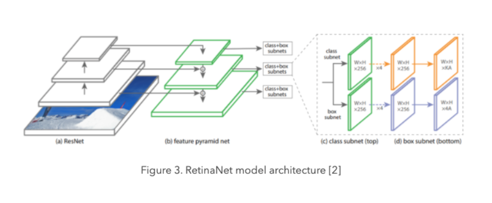

# Object Detection
______

## RetiaNet

- Object detection model `RetinaNet` has been formed by making two improvements
  over existing single stage object detection models - Feature Pyramid
  Networks and Focal Loss.

**Feature Pyramid Network**
- Feature image pyramids used to detect objects with varying scales in an image. 
- In feature image pyramids, we take an input image and subsample it into lower
  resolution and smaller size images
- With the advancements of deep learning, we now use the pyramidal hierarchical
  structure with CNNs.  
- In a CNN architecture, the output size of feature maps decreases after each
  successive block of convolutional operations, and forms a pyramidal
  structure.

**Focal Loss**
- Focal Loss is an enhancement over Cross-Entropy Loss and is introduced to
  handle the class imbalance  problem with single-stage object detection
  models.
- Single Stage models suffer from a extreme foreground-background class
  imbalance problem due to dense sampling of anchor boxes 
- Focal Loss reduces the loss contribution from easy examples and increases the
  importance of correcting misclassified examples.

**Advantages**
- Highest accuracy object detectors to date are based on a two-stage approach
  popularized by R-CNN 
- Surpassing the accuracy of all existing state-of-the-art two-stage detector

## UNETs

**UNet** is a fully convolutional network (FCN) used for image segmentation. The
goal is to predict each pixel's class in an image.

**Architecture**
- Three Main Components):
	- Encoder or Downsampling Path
	- Bottleneck
	- Decoder or Upsampling Path

**Downsampling Path:**
- Consists of two convolution layers each followed by a ReLU activation
  function and a 2x2 max pooling  operation for `downsampling`.
- At each `downsampling` step we double the number of feature channels

**Bottleneck:** 
- part of the network is between the contracting and expanding paths. The
  bottleneck is built from 2  convolutional layers (with batch normalization)
  and with dropout.

**Upsampling Path:**
- Every step in the decoder path consists of an `upsampling` of the feature map
  followed by a 2x2  convolution, a concatenation with the corresponding
  feature map from the `downsampling` path, and two convolutions layers, each
  followed by a ReLU.

**Final Layer:** 
- A 1x1 convolution is used to map each feature vector to the desired number of
  classes. 

**Loss function:** 
- The energy function is computed by a pixel-wise softmax over the final
  feature map and then applied cross-entropy loss function.

### Metrics 
- `IoU (intersection of union)` -> Area overlap / Area of Union 

**Notes**

- Means converting a high resolution image to a low resolution image. By down
  sampling, the model better understands `What` is present in the image, but
  it loses the information of `Where` it is present.

**Advantages**

- UNet combines the location information from the downsampling path to finally
  obtain a general information combining localisation and context, which is
  necessary to predict a good segmentation map.
