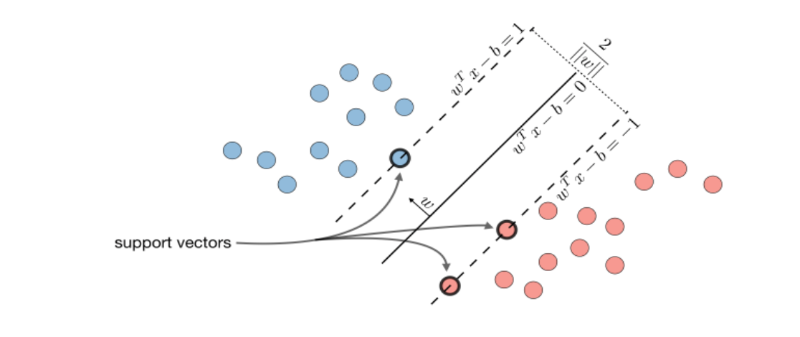
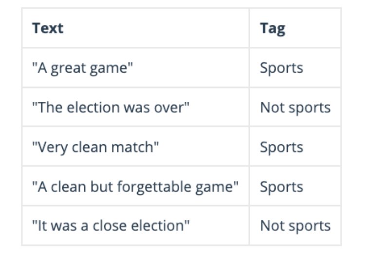
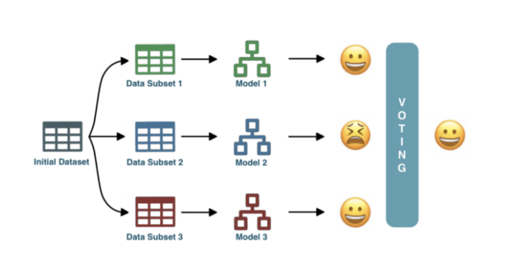
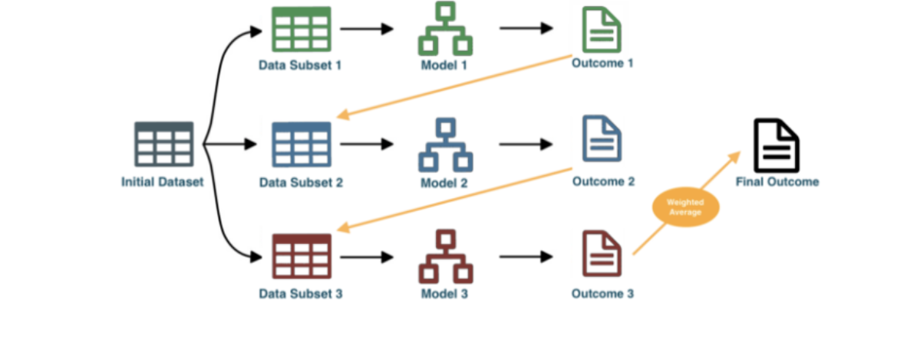
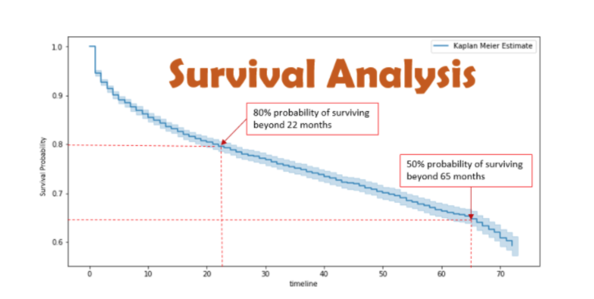
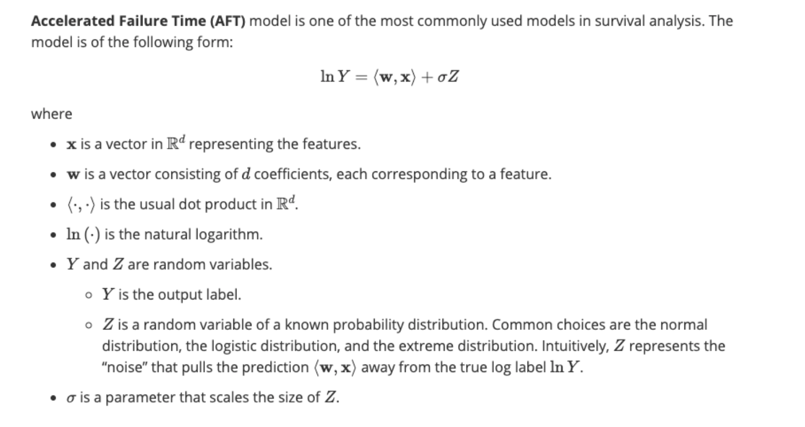
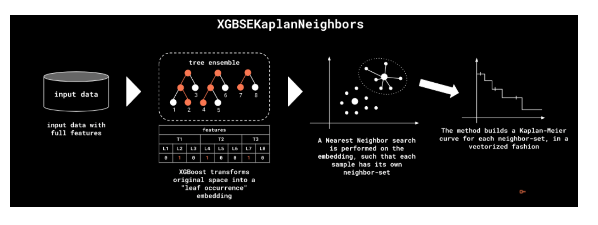

# Machine Learning Algorithms 
__________

### Linear Regression

- Multi-variable linear equations might look like this, where 𝑤 represents the
  coefficients, or  weights, our model will try to learn. 

- **Goal:** minimize the residual sum of squares between the observed targets
  in the dataset, and the  targets predicted by the linear approximation.

- **Loss Function:** To minimize MSE (or L2 Loss) we use Gradient Descent to
  calculate the gradient of  our cost function:

### Logistic Regression 

- Unlike linear regression which outputs continuous number values, logistic
  regression transforms its  output using the logistic sigmoid function to
  return a probability value which can then be mapped to two or more discrete
  classes.

**Loss Function**:  Cross-Entropy
- Same process as Linear Regression, except we replace the sigmoid function
  with the softmax function.  
- Why don’t we use MSE for classification problems?
  - Our prediction function is nonlinear (due to sigmoid transform). 
  - Squaring this prediction as we do in MSE results in a non-convex function
    with many local minimums. 
  - If our cost function has many local minimums, gradient descent may not find
    the optimal global  minimum.

### K-Nearest Neighbor
- An iterative clustering algorithm that groups samples which consist of
  similar characteristics and that are more related to each other than in
  other groups.
- Each group in the data is distributed around a central point called the
  “centroid” which is the average of the cluster. 

**Steps**
- Specify the number of clusters `k`
- Randomly pick k centroids from the data points as initial cluster centers
- Assign each sample to the nearest centroid (i.e. Euclidean distance)
- Move the centroids to the center of the samples that were assigned to it
- Repeat the third and fourth steps until the cluster assignment converges
 
 
### Support Vector Machines 
- The goal of support vector machines is to find the line that maximizes the
  minimum distance to the line.
- The decision boundary is defined as: `w^Tx - b`

 
**Kernel Trick:** - 

- Non-linear separable -> kernel mapping -> decision boundary in original space
- The "kernel trick" is used to compute the cost function using the kernel
  because we actually don't  need to know the explicit mapping ϕ, which is
  often very 

### Naive Bayes
- Naive Bayes is a probabilistic algorithm that is based on Bayes Theorem.  
- Bayes’ Theorem basically describes the probability of a feature, based on
  prior knowledge of conditions that might be related to that feature. 
- For instance, the conditional probability of B given A. 
- Our assumption is the probability that the tag of a sentence is Sports given
  that the sentence is “A very close game”

**Example:**  

- Classification: Building a classifier that says whether a text is about
  sports or not 
- Since Naive Bayes is a probabilistic classifier, we want to calculate the
  probability that the  sentence "A very close game" is Sports and the
  probability that it’s not.
- Then, we take the largest one. Written mathematically, what we want is P
  (Sports | a very close  game) — the probability that the tag of a sentence is
  Sports given that the sentence is “A very close game”.

- Since for our classifier we’re just trying to find out which tag has a bigger
  probability, we can  discard the divisor —which is the same for both tags—
  and just compare.

- This is better, since we could actually calculate these probabilities! 
- Just count how many times the sentence “A very close game” appears in the
  Sports tag, divide it by  the total, and obtain P.

**Problem**
- “A very close game” doesn’t appear in our training data, so this probability
  is zero. Unless every  sentence that we want to classify appears in our
  training data, the model won’t be very useful.
- So here comes the Naive part: we assume that every word in a sentence is
  independent of the other  ones. This means that we’re no longer looking at
  entire sentences, but rather at individual words. 

- This assumption is very strong but super useful. It's what makes this model
  work well with little  data or data that may be mislabeled. The next step is
  just applying this to what we had be
Results:

- In our case, the possible words are ['a', 'great', 'very', 'over', 'it',
  'but', 'game', 'election', 'clean', 'close', 'the', 'was', 'forgettable',
  'match'].

### Decision Tree

- A decision tree algorithm breaks down our data by making decisions based on
  asking a series of questions. 
- First, the decision tree algorithm is a top-down approach; we start at the
  tree root and split the  data on the feature that results in the largest
  **information gain**. 
- It is an iterative process and we can then repeat the splitting criteria at
  each child node until the leaves are pure.
- To determine how the features are split, we can use the concept of `entropy`,
  which measures the uncertainty
- The lower the entropy, the more predictable the class is and for higher
  entropy values, it becomes more unpredictable. 
- Next we compute the difference between the entropies before (i.e. parent
  node) and after the split (i.e. sub-nodes) yields the information gain.  
- Finally, the objective function is to maximize the information gain at each
  split, thus the  attribute with the highest change in entropy is used as the
  splitting criteria

**Problems with Decision Trees:**
- **Overfitting**: 
  - As the decision tree grows and becomes more complex the issue of
    overfitting arises. Meaning, the model has virtually memorized the
    training data but will not be expected to perform well with out-of-sample
    data. 
  
- **Underfitting**:
  - If the tree is too simple then this could result in underfitting as the
    learning value is restricted to one level of the decision tree and does not
    allow the training set to learn the data adequately; a lower complexity
    decision tree results in high bias. 

**Methods to address problem:**
- We want to prune the tree by setting a limit for the maximum depth of the tree. 
- One way is that we can observe the error vs max_depth plots and also
  implement `Gridsearch` to identify the optimal depth.

### Random Forest
- Is an ensemble based algorithm that’s built on the idea of Decision Trees. 

**How it Works:**
- Random Forest works by training an ensemble of decision trees where each tree
  is constructed from a  different sample of the original training data.
  - **Bagging**: where we sample the data with replacement. 
- Random Forest uses this sampling technique to reduce the variance in model
  predictions, by creating  many of these trees, in effect a "forest", and then
  averaging them.
- The variance of the final model can be greatly reduced compared to a single tree.
- **Feature Splitting criteria:** choose a random set of features for each split
  and then compute the entropy and information gain to determine which
  variable to split on. (see decision tree for more) 
- **Strength:**
  - Works well with missing values and outliers. 
  - Easy to tune for - minimal hyper parameters. 
- **Weakness:****Weakness**: 
  - Doesn’t offer the same level of interpretability as decision trees.

### Bagging vs Boosting**

- **Bagging**
  - `Bagging` uses sampling with replacement (e.g. some observations may be repeated) 
  - Is a way to decrease the variance of your prediction by generating
    additional data for training from your original dataset using combinations
    with repetitions to produce multisets of the same cardinality/size as your
    original data. 
  - By increasing the size of your training set you can't improve the model
    predictive force, but just  decrease the variance, narrowly tuning the
    prediction to expected outcome.

- **Boosting** 

  - `Boosting` involves the creation and addition of decision trees sequentially,
    each attempting to  correct the mistakes of the learners that came before
    it.
  - Instead of training models separately, boosting trains models sequentially,
    each new model being trained to correct the errors of the previous ones. 
  - At each iteration (round), the outcomes predicted correctly are given a
    lower weight, and the ones wrongly predicted a higher weight. 
    - It then uses a weighted average to produce a final outcome.
  - Unlike bagging, the subset creation is not random and depends upon the
    performance of the previous models: every new subset contains the elements
    that were (likely to be) misclassified by previous models.
  - Generally, boosting algorithms are configured with weak learners, decision
    trees with few layers,  sometimes as simple as just a root node.

**Boosting Rounds**
- The general reason is that on most problems, adding more trees beyond a limit
  does not improve the performance of the model.
- The reason is in the way that the boosted tree model is constructed,
  sequentially where each new tree attempts to model and correct for the
  errors made by the sequence of previous trees. Quickly, the model reaches a
  point of diminishing returns.
 
### ADA Boost
- High weights are put on errors to improve at the next boosting step.

### XGBoost
- Tree based model that uses the concept of boosting. 
- With boosting, we construct a series of trees that attempt to correct the
  mistakes of the model  before it in the sequence. 
- The first model is built on training data, the second model improves the
  first model, the third  model improves the second, and so on. 
- XGboost also uses **“Gradient Boosting”** -- which is an approach where new
  models are created that predict the residuals of prior models and then added
  together to make the final prediction so that the loss function is minimized
  using gradient descent. 
- **Loss function:** difference between predicted and actual value
- XGBoost API
  - **DMatrix**: an internal data structure that is used by XGBoost, which is
    optimized for both memory efficiency and training speed. 

**Feature Importance:**

- Three ways importance is measured: 
  - **Weight**: The number of times a feature is used to split the data across
    all trees. 
  - **Cover**: The number of times a feature is used to split the data across
    all trees weighted by  the number of training data points that go through
    those splits.
  - **Gain**: The average training loss reduction gained when using a feature
    for splitting. 
- Feature importance orderings are very different for each of the three options
  provided by XGBoost 

**Hyperparameters**

- **Learning Rate**: Step size shrinkage used in updates to prevent overfitting. 
  After each boosting step, we can directly get the weights of new features,
  and eta shrinks the feature  weights to make the boosting process more
  conservative.
- **Lambda**: L2 regularization term on weights. Increasing this value will
  make the model more  conservative.
- **Alpha**: L1 regularization term on weights. Increasing this value will make
  the model more  conservative. 
- **Gamma**: Minimum loss reduction required to make a further partition on a
  leaf node of the tree.  The larger gamma is, the more conservative the
  algorithm will be.
- **Max_depth**: Maximum depth of a tree. Increasing this value will make the
  model more complex and  more likely to overfit. 
  - 0 is only accepted in lossguided growing policy when tree_method is set as
    hist and it indicates  no limit on depth. 
  - Beware that XGBoost aggressively consumes memory when training a deep tree.
- **Subsample**: Subsample ratio of the training instances. 
  - Setting it to 0.5 means that XGBoost would randomly sample half of the
    training data prior to  growing trees. and this will prevent overfitting.
  - Subsampling will occur once in every boosting iteration.
  

**Objective Functions**
- **multi:softmax:** 
  - Set XGBoost to do multiclass classification using the softmax objective.
  - You also need to set num_class(number of classes)
- **reg:squarederror:** Regression with squared loss.
- **reg:squaredlogerror:**  Regression with squared log loss 
  - 1/2[𝑙𝑜𝑔(𝑝𝑟𝑒𝑑+1)−𝑙𝑜𝑔(𝑙𝑎𝑏𝑒𝑙+1)]^2
  - All input labels are required to be greater than -1
- **reg:logistic:**  Logistic regression
- **binary:logistic:** Logistic regression for binary classification, output probability
- **Count:poisson:** Poisson regression for count data, output mean of poisson distribution
 
**Evaluation Metrics XGB**

- **rmse**: root mean square error
- **rmsle**: root mean square log error: 
- reg:squaredlogerror
- metric reduces errors generated by outliers in the dataset. 
- **mae**: mean absolute error
- **mape**: mean absolute percentage error
- **logloss**: negative log-likelihood
- **error**: Binary classification error rate. 
  - It is calculated as #(wrong cases)/#(all cases). 
  - For the predictions, the evaluation will regard the instances with
    prediction values larger than 0. 5 as positive instances, and the others as
    negative instances.
- **merror**: Multiclass classification error rate. It is calculated as #(wrong
  cases)/#(all cases). 
- **mlogloss**: Multiclass logloss.
- **auc**: Area under the curve
- **map**: Mean Average Precision

### LightGBM

- An open-source gradient boosting library developed by Microsoft
  LightGBM brings significant improvements to vanilla GBT and can be used to
  train models on tabular  data with incredible speed and accuracy. 
  - Gradient-based One-Sided Sampling
  - Exclusive Feature Bundling

**XGboost Vs LightGBM**
- The main difference between these frameworks is the way they are growing.
- **XGBoost**:
  - level-wise: an approach where the trees grows horizontal 
  - level-wise splits based on the contribution to loss of particular branch
- **LightGBM**
  - leaf-wise an approach where the trees grows vertically.
  - Leaf-wise splits nodes based on the contribution to global loss whereas. 
  - leaf-wise is mostly faster than the level-wise (e.g 10x faster than XGboost)

### Survival Analysis

- Survival analysis models time to an event of interest. 
- It originates from clinical research and is a special kind of regression and
  differs from the conventional regression task as follows:
- The label is always positive, since you cannot wait a negative amount of time
  until the event occurs. 
- The label may not be fully known, or censored, because “it takes time to
  measure time.” 

**Censoring**
- Some experimenters could not get a complete measurement for that label. We
  consider this as “partially observed” 
- **Example**: if we look at healthcare data and you have a patient who
  survived the first 30 days and  walked out of the clinic on the 31st day, so
  his death was not directly observed.
- Another possibility: The experiment was cut short (since you cannot run it
  forever) before his death could be observed.

- **There are four kinds of censoring:**
  - **Uncensored**: the label is not censored and given as a single number.
  - **Right-censored:** the label is of form [a,+∞), where a is the lower bound.
  - **Left-censored**: the label is of form [0,b], where b is the upper bound.
  - **Interval-censored**: the label is of form [a,b], where a and b are the lower and upper bounds, respectively.

**Prepare Training Data:** 
- Survival times are subject to right-censoring, therefore, we need to consider
  an individual’s status in addition to survival time. 
- To structure our training data, we need two fields. The first field
  indicating whether the actual survival time was observed or if was censored,
  and the second field denoting the observed survival time, which corresponds
  to the time of death.

**Hazard Function**
- Along with the survival function, we are also interested in the rate at which
  event is taking place , out of the surviving population at any given time t. 
- In medical terms, we can define it as “out of the people who survived at time
  t, what is the rate of dying of those people”.

**Kaplan–Meier** 
- Since we don’t have the true survival curve of the population, thus we will
  estimate the survival curve from the data. 
- KM is a non-parametric statistic used to estimate the survival function from
  lifetime data. The survival curve is defined as the probability of surviving
  in a given length of time. 
- If we choose not to include the censored data, then it is highly likely that
  our estimates would be  highly biased and under-estimated. 
- The inclusion of censored data to calculate the estimates, makes the Survival
  Analysis very  powerful. 

**Accelerated Failure Time** 
- The first step is to express the labels in the form of a range, so that every
  data point has two  numbers associated with it, namely the lower and upper
  bounds for the label.
https://xgboost.readthedocs.io/en/latest/tutorials/aft_survival_analysis.html

**XGBoost Survival Embeddings**
- Apply Kaplan-Meier on nearest neighbors to generate SA curves for each nearest neighbor segmentation. 

