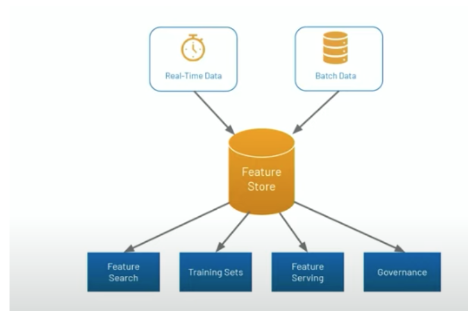

# Feature Store
_____

### Overview
- Data engineers, data scientists and ML engineers spend an inordinately large amount of time transforming data from its raw form into the final “features” that can be consumed by ML models.
- This process is also called “feature engineering” and can involve anything from aggregating data (e.g. number of purchases for a user in a given time window) to complex features that are the result of ML algorithms (e.g. word embeddings).

**Challenges**

- Online/offline skew: For some of the most meaningful ML use cases, models need to be deployed online at low latency (think of a recommendation model that needs to run in tens of milliseconds when a webpage loads). The transformations that were used to compute features at training time (offline) now need to be repeated in model deployment (online) at low latency. 
- `Reusability` and `discoverability`: In most cases, features get reimplemented several times because they are not discoverable, and if they are, they are not managed in a way that facilitates reuse. Naive approaches to this problem provide search based on feature names, which requires data scientists to correctly guess which names someone else used for their features. 
- Furthermore, there is no way that data scientists can know which features are used where, making decisions such as updating or deleting a feature table difficult.

**Feature Store Purpose**
- Takes data in (real-time or batch) from databases and serves as a single source of truth and a repository of features. 

**Requirements**
- Scalability (e.g. billions of records and hundreds/thousands of features)
- Feature vector retrieval by primary key for inference (e.g. < 5ms)
- Point in time consistency on training data
- Event driven feature updates
- Batch feature updates on time series 
- Track feature Lineage 
-  Backfill new features