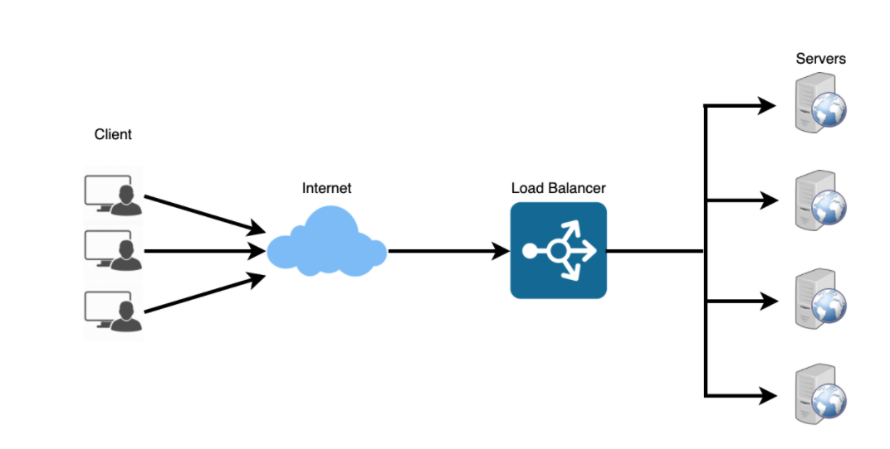
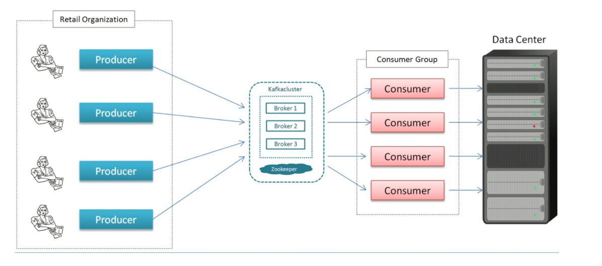

# Infrastructure
_____

### Load Balancers
- Helps distribute the traffic across a cluster of servers to improve responsiveness and availability of applications.
- Preventing requests from going to unhealthy servers
- Preventing overloading resources
- Helping to eliminate a single point of failure
- Load balancing helps you scale horizontally across an ever-increasing number of servers
- Typically a load balancer sits between the client and the server accepting incoming network and application traffic and distributing the traffic across multiple backend servers using various algorithms. 
- By balancing application requests across multiple servers, a load balancer reduces individual server load and prevents any one application server from becoming a single point of failure, thus improving overall application availability and responsiveness.
- Load balancers should only forward traffic to “healthy” backend servers. To monitor the health of a backend server, “health checks” regularly attempt to connect to backend servers to ensure that servers are listening.
- The load balancer can be a single point of failure; to overcome this, a second load balancer can be connected to the first to form a cluster.



**Route Traffic**
- `Layer 4 `load balancers look at info at the transport layer to decide how to distribute requests. 
- Generally, this involves the source, destination IP addresses, and ports in the header, but not the contents of the packet.
- ` Layer 4 `load balancers forward network packets to and from the upstream server, performing Network Address Translation (NAT).
- `Layer 7 `load balancers look at the application layer to decide how to distribute requests. This can involve contents of the header, message, and cookies. 
- `Layer 7` load balancers terminate network traffic, reads the message, makes a load-balancing decision, then opens a connection to the selected server. 

**Disadvantages**
- The load balancer can become a performance bottleneck if it does not have enough resources or if it is not configured properly.
- Introducing a load balancer to help eliminate a single point of failure results in increased complexity.
- A single load balancer is a single point of failure, configuring multiple load balancers further increases complexity.

### Application Gateway
- Is a web traffic load balancer that enables you to manage traffic to your web applications. Traditional load balancers operate at the transport layer (OSI layer 4 - TCP and UDP) and route traffic based on source IP address and port, to a destination IP address and port.
- Application Gateway can make routing decisions based on additional attributes of an HTTP request, for example URI path or host headers. 
- For example, you can route traffic based on the incoming URL. So if /images is in the incoming URL, you can route traffic to a specific set of servers (known as a pool) configured for images.

### Content Delivery Networks

- A content delivery network (CDN) is a distributed network of servers that can efficiently deliver web content to users. 
- CDNs' store cached content on edge servers in point-of-presence (POP) locations that are close to end users, to minimize latency.
- CDN’s are typically used to cache static content such as images, CSS, or HTML.
(push or put).
- A CDN’s mission is to virtually shorten that physical distance, the goal being to improve site rendering speed and performance.


**Steps**
- A user (Alice) requests a file (also called an asset) by using a URL with a special domain name, such as <endpoint name>.azureedge.net. This name can be an endpoint hostname or a custom domain. 
- The DNS routes the request to the best performing POP location, which is usually the POP that is geographically closest to the user.
- If no edge servers in the POP have the file in their cache, the POP requests the file from the origin server. The origin server can be a backend file store.
- The origin server returns the file to an edge server in the POP.
- An edge server in the POP caches the file and returns the file to the original requestor (Alice). The file remains cached on the edge server in the POP until the time-to-live (TTL) specified by its HTTP headers expires. If the origin server didn't specify a TTL, the default TTL is seven days.
- Additional users can then request the same file by using the same URL that Alice used, and can also be directed to the same POP.
- If the TTL for the file hasn't expired, the POP edge server returns the file directly from the cache. 
- This process results in a faster, more responsive user experience.


### Microservices
- Can be described as a suite of independently deployable, small, modular services. 
- Each service runs a unique process and communicates through a well-defined, lightweight mechanism to serve a business goal


### Airflow
- Airflow is a platform to programmatically author, schedule and monitor workflows
- Airflow creates workflows as Directed Acyclic Graphs (DAGs) of tasks. 
- `DAG` is defined in a Python script, which represents the DAGs structure (tasks and their dependencies) as code.
- Interface makes it easy to visualize pipelines running in production, monitor progress, and troubleshoot issues.
- Airflow pipelines are configured as code (Python), allowing for dynamic pipeline generation. This allows for writing code that instantiates pipelines dynamically.
Scalable: 
Airflow has a modular architecture and uses a message queue to orchestrate an arbitrary number of workers. Airflow is ready to scale to infinity.

**Example**
```
db_operator = DatabricksSubmitRunOperator(task_id=name, json={cluster configs})
t1 = db_operator(‘name’,’train.py’,[‘--arg’,’arg_name’]
t2 = db_operator(‘name’,’deploy.py’,[‘--arg’,’arg_name’]
t1 >> [t2]
```

**Create docker image w/ airflow dags**

```
Docker-compose for deploying web server
Create web server using airflow latest image
Add sqlite database and configuration
Add volumes
Setup ports
Run command for health checks
```

### Kafka 
- **Producer**: sends message record
- **Consumer**: an application that receives data from Kafka
- **Broker**: Kafka Server (message broker) between producer and consumer
- **Cluster**: A group of servers sharing workload for a common purpose that each executes one instance of a broker.
- **Topic**: is a unique name for a Kafka stream. 
- **Partition**: breaks a topic into subsets of data that’s distributed across cluster. The end-user makes a decision on which predicate to partition on.
- **Offset**: a sequence id given to a message as they arrive in a partition.The sequence id is stored in order based on arrival.
  - Offsets are local to the partition. 
- **Global Identifier:** Topic Name -> Partition Number -> Offset
- **Consumer Group:** group of consumers acting as a single unit to divide the work. 
  - The maximum consumers in a group is equal to the number of partitions on the topic. 
  - Kafka does not allow more than 2 consumers to read from a partition simultaneously; this avoids double reading of records.
- **Scaling**: occurs horizontally and does not have to manually scale. 

