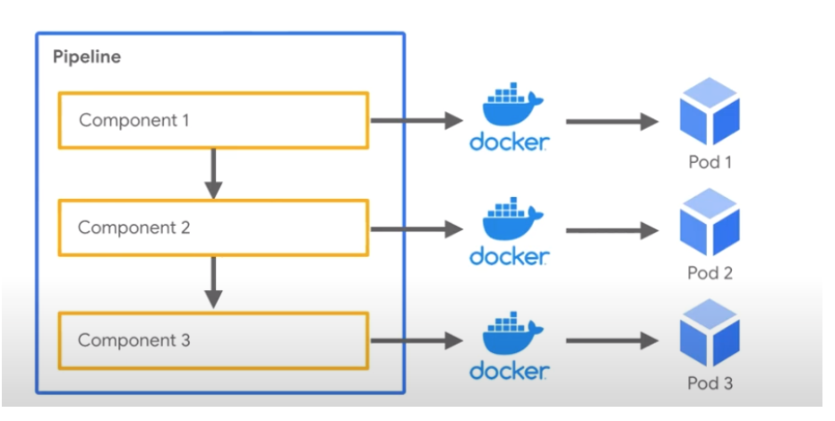

# Kubernetes
_____

### Overview

- Open-source platform for managing your containers
- Microservices architecture - more agile versus hadoop 
- Containerized applications allows for consistent environments 
  - Moving between Development and Production environments
- Scaling large scale workloads and can leverage frameworks like Spark
- Spark creates a spark driver running within a kubernetes on a pod
- Workers are deployed in the Kubernetes cluster

### Pods 
- Group of one or more containers
- shared storage/network resources
- Instructions for how to run the containers
  - Pods scheduled on nodes (e.g. virtual machine)
  - Nodes run node agents called Kublet
- All communication happens through the API server

### Volumes
- Volume represents a way to store, retrieve, and persist data across pods and through the application lifecycle
- Applications often need to be able to store and retrieve data. 
- **Ephemeral:**
  - disposable resources, different approaches are available for applications to
    use and persist data as necessary.
    Kubernetes volumes can also be used as a way to inject data into a pod for use by the containers.
    - Secrets/configs/metadata

**Persistent Volume:**
- Volumes that are defined and created as part of the pod lifecycle only exist until the pod is deleted.

### MiniKube
- Runs single node kubernetes cluster on your local laptop
- Use base docker image for Spark - pull image from DockerHub
  - Make spark distribution tarball
  - Build the image for Spark
- Instead can use Helm - a package manager to kubernetes for configuration
  - Helm charts for Spark setup (not familiar with)
  - Assists with building config.yaml file for JupyterHub

**Commands:**

- **Create pod:** `Kubectl create -f jupyperlab.yaml`
- **Create service (DNS entry):** `Kubectl create -f jupyperlab-service.yaml`
- **Pod status:** `Kubectl get pods`, `Kubectl get services`
  - Forward ports to access Jupyter Notebooks
  - Access Kubernetes UI
  - Can see status of pods

### Kubeflow
- Curated set of tools for running ML workflows
- Makes ML use-cases portable and scalable
- Easily deploy workflows to Kubernetes
- Train models, Tensorboard, serve model, build pipelines 
- Login to Jupyter Hub

