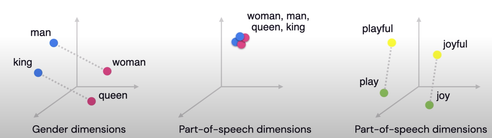

# Word Embeddings
_____
- Mechanism to express relationships in relative vector distance. 
- Method where words are encoded as real-valued vectors in a high dimensional
  space, where the similarity between words in terms of meaning translates to
  closeness in the vector space. 
  The vector representations capture quite a bit of the information, meaning,
  and associations of words: 
- In other words, emeddings represent words in a way that captures semantic. 
  relationships -  the ability to tell if words are similar or not. 
- From the word embeddings model, similar words would be in close proximity.


[Reference](https://www.youtube.com/watch?v=LE3NfEULV6k)

**Why Embeddings**
- When you're dealing with words in text, you end up with tens of thousands of
  classes to predict, one for each word.  
- Trying to one-hot encode these words is massively inefficient; you'll have a
  sparse vector representation where an element is set to 1 and the other
  50,000+ set to 0. 
- This ends up causing the matrix multiplication in the first hidden layer to
  have almost all  of the resulting values be zero and is a huge waste of
  computation. 
- To solve this problem and greatly increase the efficiency of our networks, we
  can use embeddings. 

**How do embedding work?**
- We basically train a simple neural network with a single hidden layer with
  the goal to learn the weights of the hidden layer, which are the work
  vectors.  
- We cannot just feed a word just as a text string to a neural network, so we
  instead create a one-hot encoded vector for each of these words in the
  vocabulary; which is the length of our one-hot encoded vector.  
- The hidden layer is going to be represented by a weight matrix with one for
  every word in our vocabulary and one for every hidden neuron. 
- The output of the hidden layer is just the “word vector” for the input word.
- The output of the network is a single vector containing, for every word in
  our vocabulary, compute the softmax to obtain the probability that a randomly
  selected nearby word is that vocabulary word. 
- Can compute the cosine similarity of the angle between such vectors should be
  close to 1, angle between vectors close to 0). 

**<span class="label label-warning">Limitations</span>**
  - Impossible to know word representation in the context of the full sentence.
  - Example: the word “present” - can mean gift or time, depending on the context.


# Word2Vec 
- **Summary**: In this technique, we map each word of a sentence to an
  embedding vector which tends to be smaller than a bag of word representation.
- Word2Vec embeddings are pre-trained embeddings that have been determined in an
unsupervised manner. 
  - These vectors have a really nice property, similar context words tend to
    have vectors that are collinear; point to roughly the same direction. 
  - Example: Words that show up in similar contexts, such as:
    - "blue", "red", and "white" will have vectors near each other. 
- **Pre-trained Model:**
  - Data size 1.5GB
  - It includes word vectors for a vocabulary of 3 million words phrases that
    they trained on roughly 100 billion words from a Google News dataset. 

**<span class="label label-warning">Problems</span>**
- Perhaps the biggest problem with word2vec is the inability to handle unknown
  or out-of-vocabulary (OOV) words. If your model hasn't encountered a word
  before, it will have no idea how to interpret it or how to build a vector for
  it. 

**How it works**

- Before the training process starts, we pre-process the text we’re training
  the model against. In this step, we determine the size of our vocabulary and
  which words belong to it. 
- At the start of the training phase, we create two matrices – an Embedding
  matrix and a Context matrix.  
- These two matrices have an embedding for each word in our vocabulary (So
  vocab_size is one of their dimensions). The second dimension is the number of
  units in the hidden layer, which is the embedding_size – 300 is a common
  value.  
- At the start of the training process, we initialize these matrices with
  random values. Then we start the training process. In each training step, we
  take one positive example and its associated negative examples.  
- We proceed to look up their embeddings – for the input word, we look in the
  Embedding matrix. For the context words, we look in the Context matrix. 
  we take the dot product of the input embedding with each of the context
  embeddings. In each case, that would result in a number, that number
  indicates the similarity of the input and context embeddings. To turn into
  probabilities, we can take the sigmoid.  
- Now that the untrained model has made a prediction, and seeing as though we
  have an actual target label to compare against, let’s calculate how much
  error is in the model’s prediction. To do that, we just subtract the sigmoid
  scores from the target labels. And then we perform back propagation to update
  the weights. 
 

[Reference](https://www.youtube.com/watch?v=LE3NfEULV6k)

**Code Example**
```
from gensim.models import Word2Vec
model = gensim.models.Word2Vec(data, min_count = 1, size = 100, window = 5)
model.similarity('alice', 'machines'))
```


