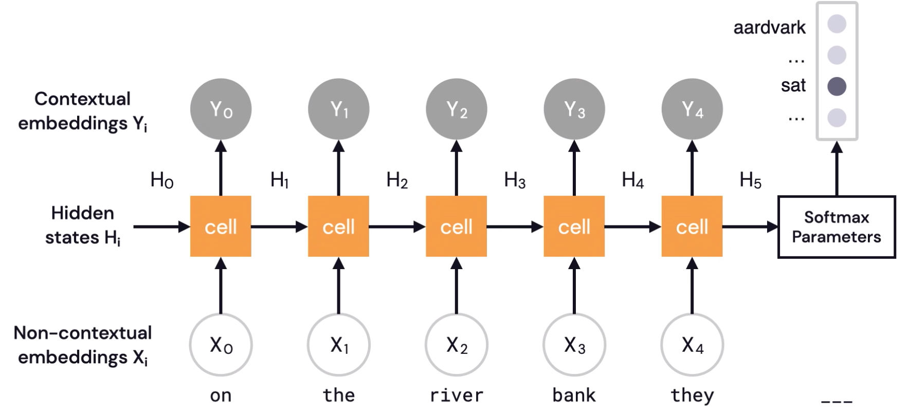
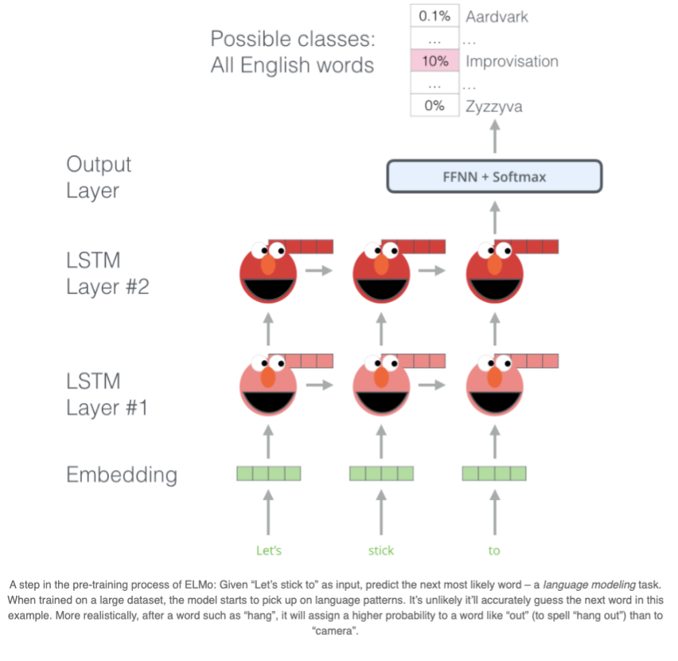

# Sequence Modeling
_____

### Recurrent Neural Networks
- Recall one of the issues with word embeddings is they are
  context-independent. `RNNs` can be leveraged to help
  contextualize embeddings and words can be disambiguated based on their context.

**Disadvantages**
- Slow: O(N) is the number of tokens.
- Vanishing Gradient: cannot process long sentences.
- Unidirectional: process text left to right. 

[Reference](https://www.youtube.com/watch?v=LE3NfEULV6k)

### Bidirectional LSTM

**Note**: The training is called bidirectional language model (biLM) that can learn from the past and predict the next word in a sequence of words like a sentence.

**Difference between BI-LSTM vs LSTM:**
- Unidirectional LSTM only preserves information of the past because the only inputs it has seen are from the past.
Using bidirectional will run your inputs in two ways, one from past to future and one from future to past and what differs this approach from unidirectional is that in the LSTM that runs backwards you preserve information from the future and using the two hidden states combined you are able in any point in time to preserve information from both past and future.

### ELMo 

- **In short:** ELMo attempts to dynamically assign a vector to a word, based on the sentence within which it’s contained. Instead of a look-up table with a word and an embedding like Word2Vec, the ELMo model lets users input text into the model, and it generates an embedding based on that sentence. Thus, it can generate different meanings for a word depending on the context.
- ELMo (2018), a new technique for embedding words into real vector space using bidirectional LSTMs trained on a language modeling objective
- ELMo gained its language understanding from being trained to predict the next word in a sequence of words. 
This is convenient because we have vast amounts of text data that such a model can learn from without needing labels.
- Instead of using a fixed embedding for each word, ELMo looks at the entire sentence before assigning each word in it an embedding. It uses a bi-directional LSTM trained on a specific task to be able to create those embeddings.
- ELMo has a great understanding of the language because it’s trained on a massive dataset, ELMo embeddings are trained on the 1 Billion Word Benchmark. 

