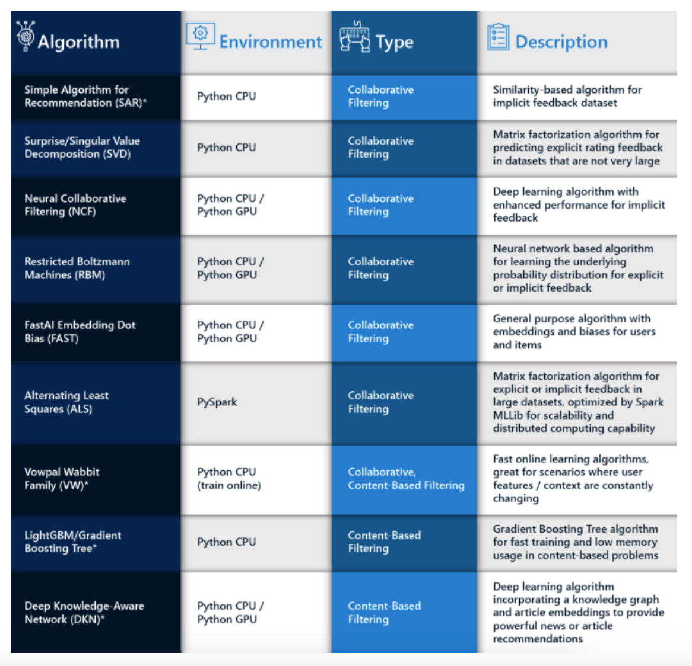
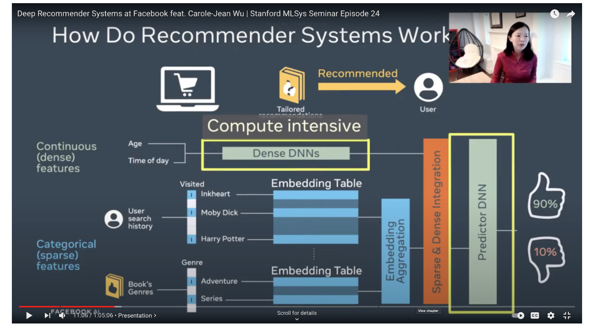
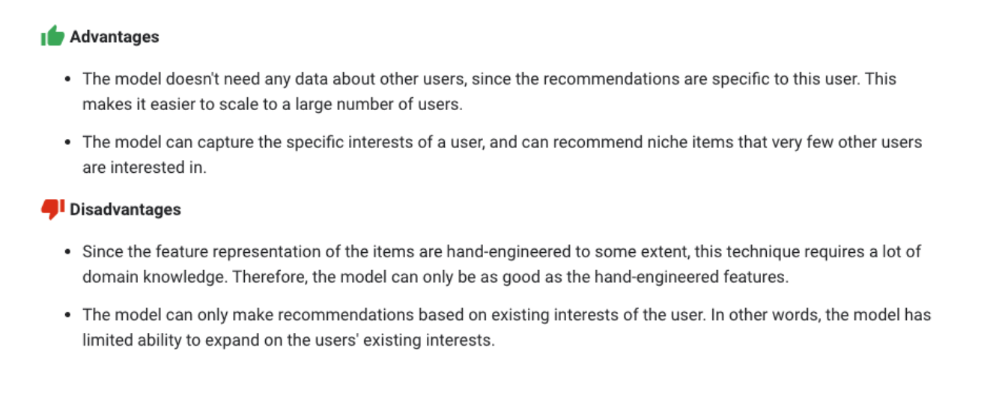
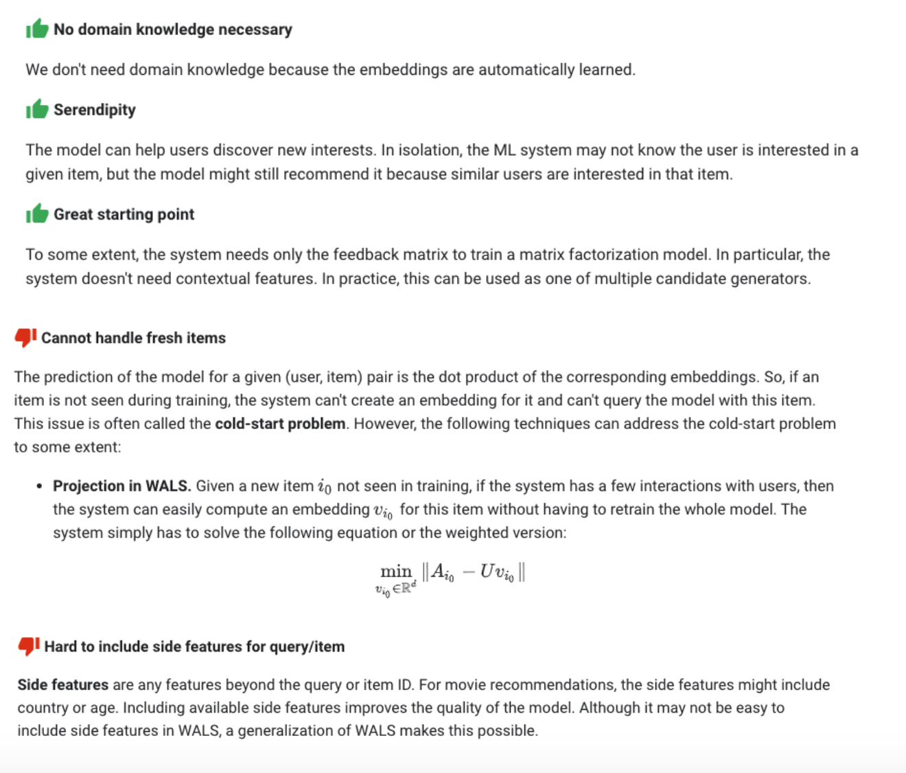
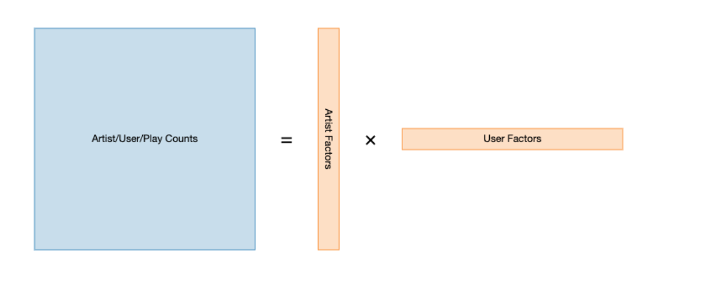
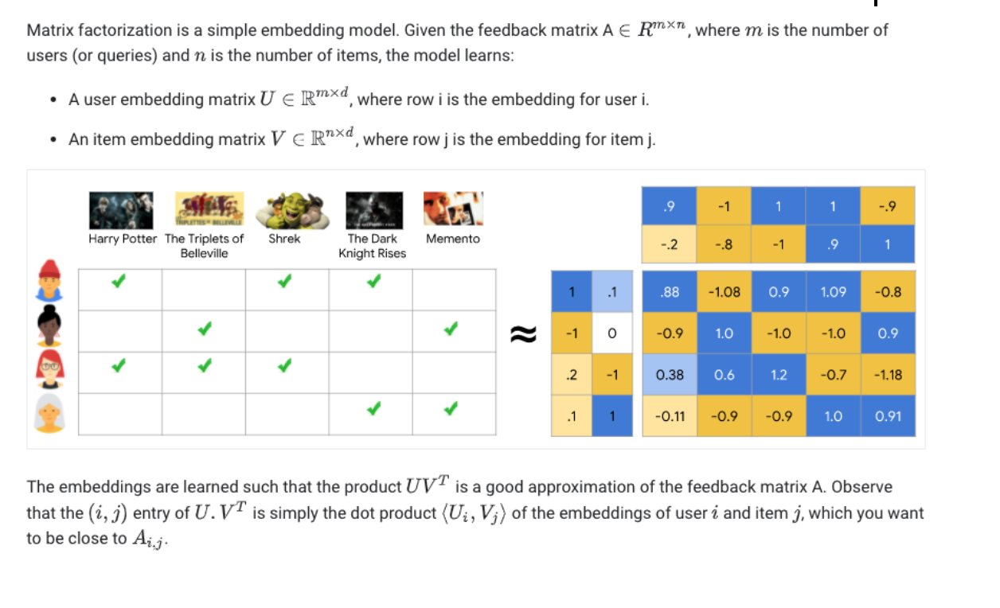
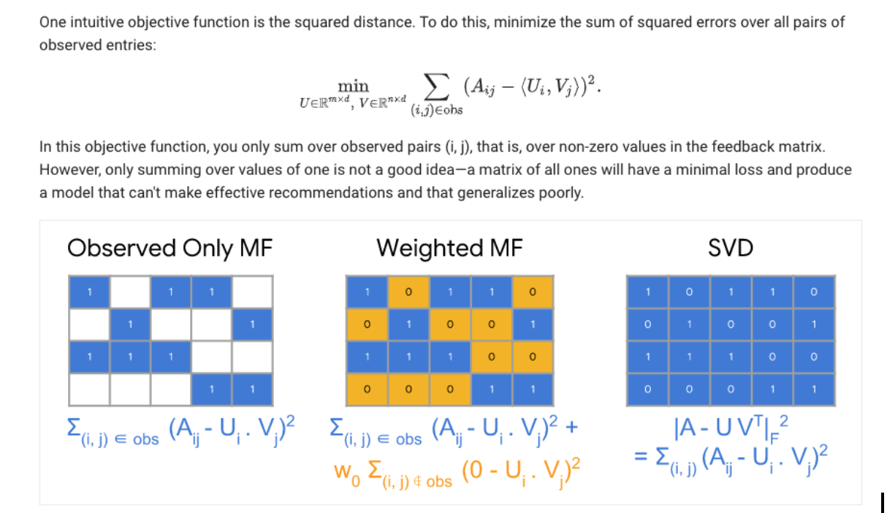
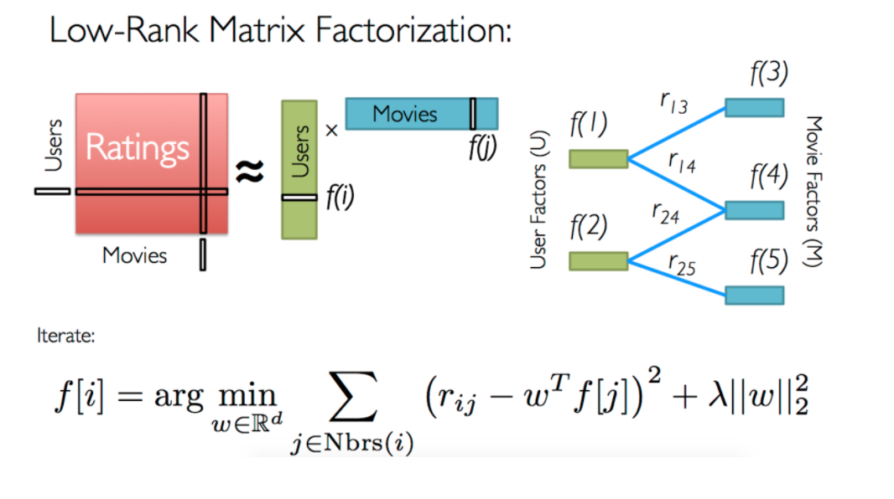

# Algorithms Overview
_____

### Overview Diagram

### Content-based filtering 
- Content-based filtering uses item features to recommend other items similar
  to what the user likes,  based on their previous actions or explicit
  feedback.
  
**Advantages vs Disadvantages**

### Collaborative Filtering
- Collaborative filtering uses similarities between users and items simultaneously to provide recommendations.
- Collaborative Filtering models can recommend an item to user A based on the
  interests of a similar  user B. 
- In practice, the embeddings can be learned automatically without relying on
  hand-engineering of  features, which is the power of collaborative filtering
  models.
- We can apply Matrix Factorization to identify the relationship between users
  and items entities.   
- **Data Sources**
  - **Explicit—** users specify how much they liked a particular movie by
    providing a numerical rating. 
  - **Implicit—** if a user watches a movie, the system infers that the user is interested.

**Advantages vs Disadvantages** 

### Matrix Factorization

- The idea is to take the original user-item matrix, and then reduce that down
  to two much smaller  matrices that approximates the original when multiplied
  together such that the loss between the multiplication of the two smaller
  matrices and the true user-item matrix is minimized (See Loss Functions
  Below)
- Matrix factorization algorithm tries to find latent factors that represent intrinsic user 
and item attributes in a lower dimension 
- With Matrix Factorization we can throw away having to come up with features
  that connect users and items and instead use the user-item data we have to 

### Loss Function

- The objective function is simply the sum of squared distances between
  predicted ratings and actual ratings, so this is what we need to minimize.
- Common algorithm to minimize the loss function is Stochastic Gradient Descent 

### Regularization
- But in order to prevent overfitting to the training data we need to constrain
  the learned values for our user and item features by penalizing high values.
  
- We do this by multiplying the sum of the squares of the elements of the user
  and item matrices by a configurable regularization parameter and including
  this in our cost function. 

### Sparse Matrix
- The ratings matrix is sparse, meaning most of the values are 0, because each
  user has only rated a small number of items. 
- The concept of a sparse matrix can actually be translated to a different data
  structure that retains only information about the non-zero values, making it
  a much more memory-efficient representation of the same information. 
- One way is to define a vector of row indices, i, a vector of column indices,
  j, and a vector of values for each (i,j) pair. So only the (i,j) pairs that
  have values are included. Using this format, known as coordinate list or COO,
  the above ratings would be expressed as follows:

### Alternating Least Squares

- The latent factor terms in the loss function are non-convex and therefore
  Gradient descent method can be applied but this will be expensive
  computations.
- The ALS algorithm was developed to overcome this limitation.
- ALS is to learn one of ‘w’ and ‘f’ at a time for optimization while keeping
  the other as constant. This makes the objective at each iteration convex and
  solvable.
 

**Advantage:** 
- Can be parallelised and/or distributed, which makes the algorithm desirable
  for use cases where the dataset is large and thus the user-item rating
  matrix is super sparse.

**Implementation:**
- Scoring metric for explicit data: RMSE, MSE, R^2
- The recommended items should be different from those that have been rated by the users
- Prediction performance of a Spark ALS model is often affected by the parameters. 
 
### Implicit ALS
- Link: https://www.benfrederickson.com/matrix-factorization
