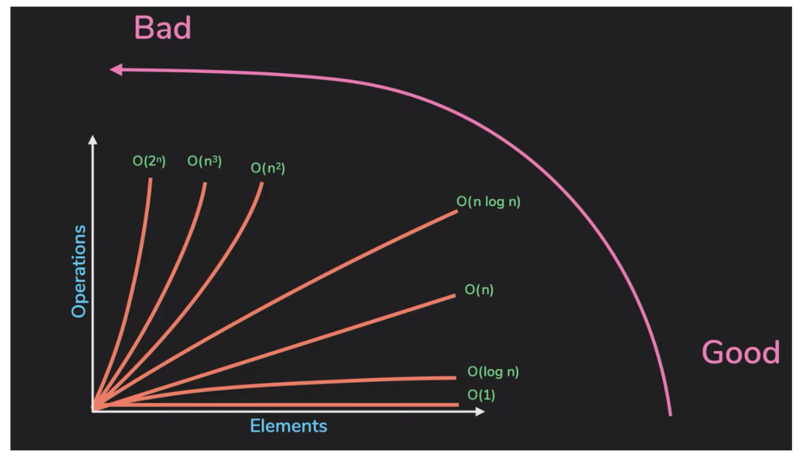
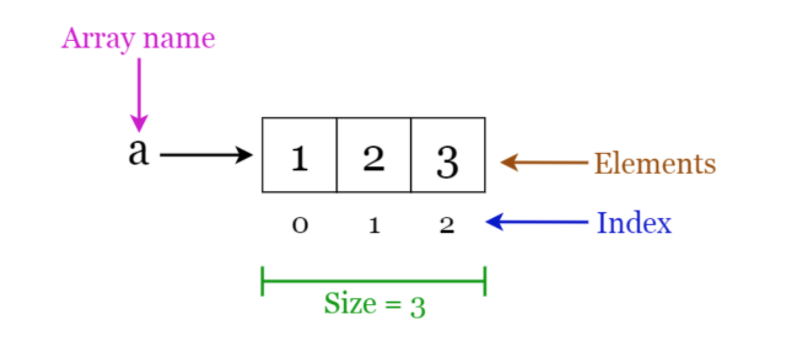
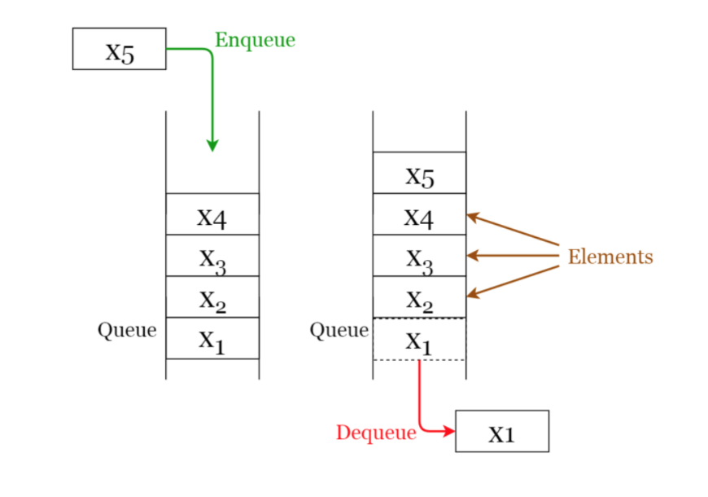
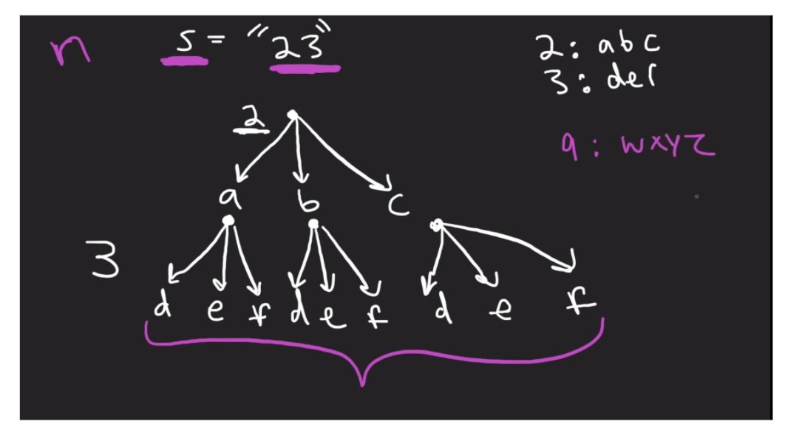

# Data Structures & Algorithms
_____

### Time Compexity 

**Cheat Sheet**
- [Link](https://www.geeksforgeeks.org/complexity-cheat-sheet-for-python-operations/)
  
**Examples**
- O(1):
  - linear operation
  - hashmap lookup  
- O(n):
  - for loop
- O(n2):
  - loop inside of a loop
- O(log n):
  - Binary Search: input size is divided in half for each loop
  - Heaps 
- O(nlog n)
  - sort array 

**Linear Time Complexity**

### Array
- Structure of fixed-size, which can hold items of the same data type. - It can
  be an array of  integers, an array of floating-point numbers, an array of
  strings or even an array of arrays (such as 2-dimensional arrays). 
- Arrays are indexed, meaning that random access is possible.
- **Traverse**: Go through the elements and print them.
- **Search**: Search for an element in the array. You can search the element by
  its value or its index 
- **Update**: Update the value of an existing element at a given index

### Deque (Python)
- Deque (Doubly Ended Queue) in Python is implemented using the module “collections“. 
- Deque is preferred over list in the cases where we need quicker append and
  pop operations from both the ends of container, as deque provides an O(1)
  time complexity for append and pop operations as compared to list which
  provides O(n) time complexity.

### Linked List
- Sequential structure that consists of a sequence of items in linear order
  which are linked to each  other. Hence, you have to access data sequentially
  and random access is not possible. 
- Linked lists provide a simple and flexible representation of dynamic sets
- Elements in a linked list are known as nodes.
  - Each node contains a key and a pointer to its successor node, known as next.
  - The attribute named head points to the first element of the linked list.
  - The last element of the linked list is known as the tail.

### Stacks
- Linear data structure that stores items in a `Last-In/First-Out` or `First-In/Last-Out`.
- A new element is added at one end and an element is removed from that end only. 
- The insert and delete operations are often called push and pop.
-	**Push**: Insert an element on to the top of the stack.
-	**Pop**: Delete the topmost element and return it.

### Queues
- Linear data structure that stores items in First In First Out (FIFO). 
- With a queue the least recently added item is removed first. 
**Enqueue**: Insert an element to the end of the queue.
**Dequeue**: Delete the element from the beginning of the queue.

  
### Hash Map
- A special function named as the hash function (h) is used to overcome the
  aforementioned problem in direct addressing.
- In direct accessing, a value with key k is stored in the slot k. Using the
  hash function, we calculate the index of the table (slot) to which each
  value goes. The value calculated using the hash function for a given key is
  called the hash value which indicates the index of the table to which the
  value is mapped.
  - **h**: Hash function
  - **k**: Key of which the hash value should be determined
  - **m**: Size of the hash table (number of slots available). A prime value
    that is not close to an exact power of 2 is a good choice for m.
   

### Recursion
 
- Recursion is a method of solving problems that involves breaking a problem
  down into smaller and smaller subproblems until you get to a small enough
  problem that it can be solved trivially. 
- Usually recursion involves a function calling itself.

**Notes**
- A recursive algorithm must have a base case.
- A recursive algorithm must change its state and move toward the base case.
- A recursive algorithm must call itself, recursively.

**Recursive function in Python**
- When a function is called in Python, a stack frame is allocated to handle the
  local variables of the function.
- When the function returns, the return value is left on top of the stack for
  the calling function to access.
- Even though we are calling the same function over and over, each call creates
  a new scope for the variables that are local to the function.

### Trees
- A tree is a hierarchical structure where data is organized hierarchically and
  are linked together. This structure is different from a linked list whereas,
  in a linked list, items are linked in a linear order.
- A binary search tree (BST), as the name suggests, is a binary tree where data
  is organized in a hierarchical structure. This data structure stores values
  in sorted order.
- Every node in a binary search tree comprises the following attributes.
**key**: The value stored in the node.
**left**: The pointer to the left child.
**right**: The pointer to the right child.
**p**: The pointer to the parent node.

 
### Depth First Search Trees

- Depth-first search is an algorithm for traversing or searching tree or graph
  data structures. 
- The algorithm starts at the root node (selecting some arbitrary node as the
  root node in the case of  a graph) and explores as far as possible along each
  branch before backtracking. 

**Stpes**
- Start from the root or any arbitrary node and mark the node and move to the
  adjacent unmarked node. 
continue this loop until there is no unmarked adjacent node. 
- Then backtrack and check for other unmarked nodes and traverse them. 
- Finally, print the nodes in the path.

**Algorithm**: 
- Create a recursive function that takes the index of the node and a visited array.
- Mark the current node as visited and print the node.
- Traverse all the adjacent and unmarked nodes and call the recursive function
  with the index of the adjacent node.
 
**Example**

### DFS vs BFS

### Heaps
- A special case of a binary tree where the parent nodes are compared to their
  children with their values and are arranged accordingly.
  Only the root is deleted when performing a delete operation. 

**Min Heap** 
- The key of the parent is less than or equal to those of its children. This is
  called the min-heap property. The root will contain the minimum value of the
  heap.
  
**Max Heap**
- The key of the parent is greater than or equal to those of its children. This
  is called the max-heap property. The root will contain the maximum value of
  the heap.
 
 

### Backtracking
- Common algorithm used when you want to “find all possible solution” 
- Backtracking is an algorithmic-technique for solving problems recursively by
  trying to build a solution incrementally, one piece at a time, removing
  those solutions that fail to satisfy the constraints of the problem at any
  tpoint of time 

**Main points of Backtracking**
1.) Choice: you a make a choice at each step,
2.) Constrains on the choices.
3.) Converge on goals.

### Trie Data Structure
- Common task for using this type of data structure is used for is for
  `Autocomplete` tasks. See steps below:

**Steps**
- Search for the given query using the standard Trie search algorithm.
- If the query prefix itself is not present, return -1 to indicate the same.
- If the query is present and is the end of a word in Trie, print the query.
  This can quickly be checked by - seeing if the last matching node has
  isEndWord flag set. We use this flag in Trie to mark the end of word nodes
  for the purpose of searching.
- If the last matching node of the query has no children, return.
- Else recursively print all nodes under a subtree of the last matching node.

[Reference](Reference: https://www.geeksforgeeks.org/auto-complete-feature-using-trie/)

**References**
[Abdul Bari YouTube
Channel](https://www.youtube.com/channel/UCZCFT11CWBi3MHNlGf019nw)
[NeetCode YouTube Channel](https://www.youtube.com/c/NeetCode)